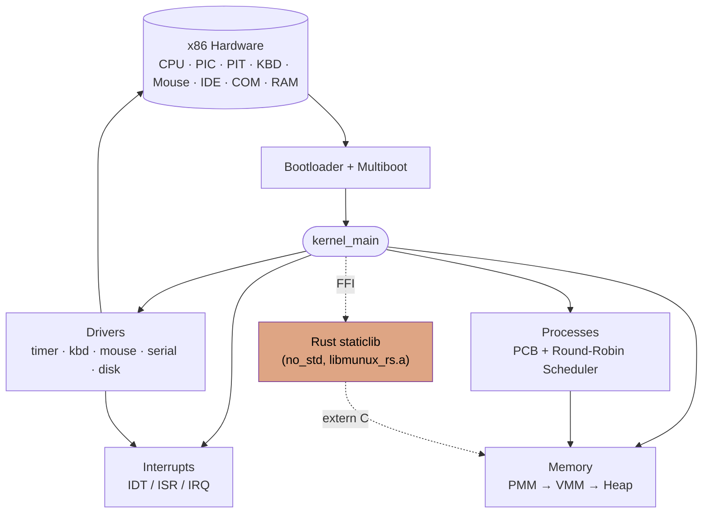

# 🌌 Munux Operating System

**Munux** is an educational operating system built from scratch with a bold goal: to make low-level systems programming accessible, elegant, and understandable. It is designed for those who don't just want to use a computer, but desire to **understand** it to its core.

The kernel is a polyglot codebase: **x86 Assembly** for bootloader and interrupt stubs, **C (C99, freestanding)** for the established core subsystems, and **Rust (`no_std`, edition 2021)** for newer and memory-sensitive components linked as a static library (see [docs/RUST.md](docs/RUST.md)).

---

## 🚀 Vision

Munux was born from an evolutionary proposal: to provide an environment that invites the user on a journey from basic usage to mastering the **kernel and terminal**.

Unlike standard Linux distributions that hide complexity, Munux exposes the internal workings of the operating system (Memory, Interrupts, Scheduling) through its own custom kernel implementation, serving as the ultimate learning tool for developers and enthusiasts.

## 🎯 Objectives

- **Build from Scratch**: A lightweight, modular kernel inspired by Unix/Linux concepts.
- **Layered Learning**: Users choose their depth—from high-level usage to low-level kernel hacking.
- **Gamified Mastery**: A progressive system that unlocks "dangerous" commands as the user proves their knowledge.
- **Transparency**: 100% open source code designed to be read and studied, not just executed.

## 💻 Who is Munux for?

- **Students**: Who want to understand how Operating Systems work under the hood.
- **Developers**: Who want to bridge the gap between software and hardware.
- **Enthusiasts**: Who dream of building or understanding their own kernel.
- **Hackers**: Who seek a deep understanding of memory management and system security.

## 🧠 Philosophy

> "I don't want you to just click.  
> I want you to understand what happens **beneath the click**."

Munux is more than software. It is a technical and philosophical learning environment about how machines truly think.

---

## ⚙️ The "Learning OS" Concept (Planned Features)

Munux aims to implement a unique "Gamified Permission System" in its user space:

### Progressive Learning Levels

The system implements five progressive levels that unlock permissions and advanced commands:

| Level | Role | Permissions & Restrictions | Safety |
|:---:|:---:|---|---|
| **1** | **Beginner** | Restricted access, basic commands only | Constant warnings & Guidance |
| **2** | **Apprentice** | More commands unlocked | Warnings before critical actions |
| **3** | **User** | Access to intermediate technical tools | Standard safety checks |
| **4** | **Power User** | Minimal restrictions | No warnings |
| **5** | **Kernel Hacker** | Full control, direct hardware access | **God Mode** (You can break everything) |

### Interactive Terminal & Testing

- **Integrated Tutorials**: A VS Code-style sidebar in the terminal explaining commands in real-time.
- **Skill Checks**: Practical challenges directly in the terminal to "level up."
- **Anti-Cheat**: Logic to ensure the user is actually learning, not just copy-pasting.

---

## 🗺️ Kernel Architecture at a Glance

The diagram below (Mermaid / UML) summarizes how Munux subsystems are wired together. GitHub renders it natively — see [docs/ARCHITECTURE.md](docs/ARCHITECTURE.md) for the full component and boot-sequence diagrams.

The dashed edges mark the **Rust integration boundary**: Rust modules are compiled as a `no_std` static library and linked into the kernel ELF, exposing a stable `extern "C"` API to the C core. See [docs/RUST.md](docs/RUST.md) for the integration model and porting plan.

## 📌 Technical Status: Version 0.3

| Version | Codename | Status | Scope |
|:---:|---|---|---|
| **0.2** | *Kernel Fundamentals* | ✅ Released | Core kernel in C / Assembly — interrupts, memory, processes, drivers |
| **0.3** | *Rust Adoption* | ✅ Released | Rust toolchain, build integration, heap allocator ported to Rust |
| **0.4** | *System Services* | 🎯 Current focus | VFS, ext2, syscalls, user mode |

Munux is now a **polyglot kernel**. The v0.3 milestone closes the multi-cycle effort of bringing Rust into the source tree without compromising the existing C ABI: a custom `i686-unknown-none` target, a `no_std` workspace, an audited FFI boundary, and the heap allocator running in safe Rust under the existing `kmalloc` / `kfree` entry points.

### ✅ Implemented in v0.2 (C / Assembly)

**Interrupt System**
- Complete IDT with 256 entries
- Handlers for all 32 CPU exceptions
- Hardware IRQ management (remapped PIC)
- Assembly stubs for context saving

**Memory Management**
- **PMM**: Physical Memory Manager with bitmap allocation
- **VMM**: Virtual Memory Manager with paging (Two-level page tables)
- **Heap**: Kernel heap allocator (malloc/free)
- Memory protection and isolation

**Process Management**
- Complete Process Control Block (PCB) structure
- Round-robin scheduler with 4 priority levels
- Preemptive multitasking
- Optimized Context Switching in Assembly

**Device Drivers**
- **Timer**: PIT (Programmable Interval Timer) for scheduling
- **Input**: PS/2 Keyboard (ABNT2 layout) & PS/2 Mouse (3 buttons)
- **Debug**: Serial Port driver for logging
- **Storage**: ATA/IDE Disk Controller (PIO Mode)

### ✅ Implemented in v0.3 (Rust Adoption)

- **Toolchain**: pinned nightly via `rust-toolchain.toml`, `rust-src` component for `-Z build-std`, custom `i686-unknown-none` target spec (no FPU, static reloc, kernel code model)
- **Build integration**: `cargo build` invoked from the top-level `Makefile`, producing `libmunux_rs.a` and linking it into `kernel.elf` alongside the C and Assembly objects
- **Two-crate workspace**: `munux-rs` (safe-Rust core, `#![forbid(unsafe_op_in_unsafe_fn)]`) and `munux-rs-ffi` (the only crate hosting `extern "C"` exports and the `#[panic_handler]`)
- **FFI boundary**: stable C ABI, headers generated by `cbindgen` and committed to the repo (`kernel/rust/include/munux_rs.h`)
- **First subsystem ported — Heap Allocator**: first-fit allocator with adjacent-block coalescing, identical semantics to the legacy C heap; the C entry points `kmalloc` / `kfree` are now thin wrappers over the Rust implementation
- **IRQ-safe locking**: handrolled `IrqMutex<T>` (spin-lock + `cli` / `sti`) used by the allocator and ready to extend to any future Rust subsystem
- **Panic handling**: Rust panics are routed through the existing `kernel_panic` path, so a Rust panic surfaces identically to a C panic

### 🎯 Current Focus — v0.4 System Services

- Virtual File System (VFS) abstraction
- Ext2 file system implementation
- Freestanding C Library (`libk`)
- System Calls interface
- User Mode (Ring 3) separation

New subsystems default to Rust where the FFI cost is acceptable; legacy C subsystems are ported opportunistically when they are being substantially reworked anyway.

*See [docs/ROADMAP.md](docs/ROADMAP.md) for the detailed development plan and [docs/RUST.md](docs/RUST.md) for the Rust adoption strategy and FFI conventions.*

---

## 📚 Documentation

We believe documentation is as important as code. Explore the Munux architecture:

- **[BUILD.md](docs/BUILD.md)**: How to compile and run Munux (C, Assembly and Rust toolchains)
- **[ARCHITECTURE.md](docs/ARCHITECTURE.md)**: System design overview
- **[RUST.md](docs/RUST.md)**: Rust integration strategy, FFI boundary and porting plan
- **[MEMORY.md](docs/MEMORY.md)**: How PMM, VMM and Heap work
- **[PROCESSES.md](docs/PROCESSES.md)**: Scheduling and Multitasking internals
- **[INTERRUPTS.md](docs/INTERRUPTS.md)**: IDT and Exception handling
- **[DRIVERS.md](docs/DRIVERS.md)**: Timer, keyboard, mouse, serial and ATA drivers
- **[INDEX.md](docs/INDEX.md)**: Full documentation index (with UML diagrams)

---

## ⚖️ License

This project is licensed under the [GNU General Public License v3.0 (GPLv3)](LICENSE).

---

## ✨ Authorship

Created and maintained by **Munique Alves Pacheco Feitoza**.

