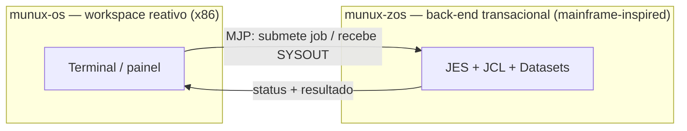

# 🌌 Munux — Ecossistema de Sistemas Operacionais

**Munux** não é um único sistema operacional — é um **ecossistema de SOs construídos do
zero**, cada um cirurgicamente focado num propósito, unidos por uma filosofia comum:
_transparência radical_ e _aprender construindo_. Os flavors **não compartilham código
"na marra"**; compartilham princípios e **conversam por uma ponte de integração de alto
nível**.

> "Não quero que você só clique.
> Quero que você entenda o que acontece **por baixo do clique**."

---

## 🧬 Os flavors

| Flavor                           | Papel                                        | Arquitetura              | Status                                        | Entrar                       |
| -------------------------------- | -------------------------------------------- | ------------------------ | --------------------------------------------- | ---------------------------- |
| [**munux-os**](munux-os/)   | Workspace reativo de propósito geral        | x86 (i686)               | **v0.3** — kernel poliglota C/ASM/Rust | [README](munux-os/README.md)  |
| [**munux-zos**](munux-zos/) | Back-end transacional inspirado em mainframe | a decidir (s390x vs x86) | **esqueleto** (projeto)                 | [README](munux-zos/README.md) |

- **munux-os** — interativo, ágil, POSIX-like. Memória, interrupções, scheduler,
  drivers. É o **painel de controle** reativo do ecossistema.
- **munux-zos** — batch pesado, _datasets_, serialização rigorosa, tolerância a falhas.
  É o **processador transacional** inspirado em IBM z/OS (reimplementação didática — sem
  código da IBM).

## 🌉 A ponte (MJP)

O valor do ecossistema está em **conectar, não fundir**. O `munux-os` (cliente) submete
jobs — no estilo JCL — ao `munux-zos` (servidor) e consome os resultados, através do
**MJP (Munux Job Protocol)**: um protocolo binário de baixo nível, com tradução
EBCDIC↔ASCII na borda.

Isso reproduz, em escala de estudo, a integração real "sistema moderno ↔ mainframe" que
é uma das maiores dores da infraestrutura corporativa (bancos, Big Techs).

Detalhes: [docs/ECOSYSTEM.md](docs/ECOSYSTEM.md) · Protocolo: [munux-zos/docs/PROTOCOL.md](munux-zos/docs/PROTOCOL.md)

---

## 🎯 Filosofia comum

- **Construir do zero**: kernels enxutos e modulares, sem esconder complexidade.
- **Aprendizado em camadas**: o usuário escolhe a profundidade — do uso ao _kernel hacking_.
- **Transparência**: 100% do código pensado para ser **lido e estudado**, não só executado.
- **Ferramenta certa para o problema certo**: cada flavor resolve uma classe de problema.

### O "Learning OS" (experiência do munux-os)

O `munux-os` implementa um **Sistema de Permissões Gamificado** que libera comandos
conforme o usuário prova conhecimento:

|   Nível   |     Papel     | Permissões                     | Segurança                        |
| :---------: | :-----------: | ------------------------------- | --------------------------------- |
| **1** |   Iniciante   | Comandos básicos               | Avisos constantes                 |
| **2** |   Aprendiz   | Mais comandos                   | Avisos antes de ações críticas |
| **3** |   Usuário   | Ferramentas intermediárias     | Checagens padrão                 |
| **4** |  Power User  | Restrições mínimas           | Sem avisos                        |
| **5** | Kernel Hacker | Controle total, hardware direto | **God Mode**                |

## 📌 Status por flavor

- **munux-os — v0.3 (Rust Adoption):** kernel poliglota (NASM + GCC + `rustc`) que dá
  boot em QEMU com IDT, PMM, VMM e o **heap allocator em Rust** (`no_std`, FFI estável).
  Foco atual v0.4: VFS, ext2, syscalls, user mode. Detalhes em
  [munux-os/README.md](munux-os/README.md) e [munux-os/docs/ROADMAP.md](munux-os/docs/ROADMAP.md).
- **munux-zos — esqueleto:** documentação e roadmap prontos; **sem código de kernel**
  ainda. Primeira decisão em aberto: arquitetura alvo. Ver
  [munux-zos/docs/ROADMAP.md](munux-zos/docs/ROADMAP.md).

## 📚 Documentação

### Ecossistema

- [docs/ECOSYSTEM.md](docs/ECOSYSTEM.md) — visão geral, flavors e a ponte MJP
- [docs/STRUCTURE.md](docs/STRUCTURE.md) — organização do repositório

### munux-os (kernel de propósito geral) — [munux-os/docs/](munux-os/docs/)

- [INDEX](munux-os/docs/INDEX.md) · [ARCHITECTURE](munux-os/docs/ARCHITECTURE.md) ·
  [RUST](munux-os/docs/RUST.md) · [MEMORY](munux-os/docs/MEMORY.md) ·
  [PROCESSES](munux-os/docs/PROCESSES.md) · [INTERRUPTS](munux-os/docs/INTERRUPTS.md) ·
  [DRIVERS](munux-os/docs/DRIVERS.md) · [BUILD](munux-os/docs/BUILD.md) ·
  [API](munux-os/docs/API.md) · [ROADMAP](munux-os/docs/ROADMAP.md)

### munux-zos (back-end mainframe-inspired) — [munux-zos/docs/](munux-zos/docs/)

- [README](munux-zos/README.md) · [ROADMAP](munux-zos/docs/ROADMAP.md) ·
  [ARCHITECTURE](munux-zos/docs/ARCHITECTURE.md) · [PROTOCOL (MJP)](munux-zos/docs/PROTOCOL.md)

---

## ⚖️ Licença

Todo o ecossistema é licenciado sob a [GNU General Public License v3.0 (GPLv3)](LICENSE).

## ✨ Autoria

Criado e mantido por **Munique Feitoza**.

