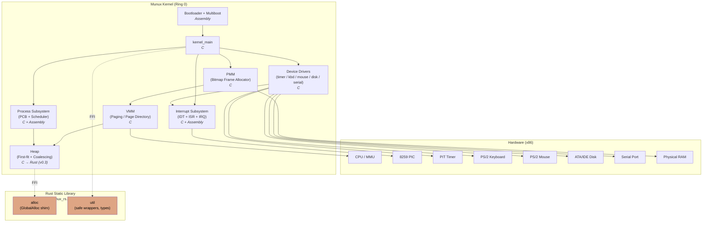

# Munux Operating System — Technical Documentation

## Overview

Munux is a modern, educational operating system designed from the ground up to provide both powerful functionality and deep learning opportunities. Built on the x86 architecture, Munux implements fundamental OS concepts including memory management, process scheduling, interrupt handling, and device drivers.

The project philosophy centers on transparency and comprehension — every component is designed to be understandable while maintaining production-quality code standards.

## Implementation Languages

Munux is a polyglot kernel with each language assigned to the layer where it provides the most value:

| Language | Role | Rationale |
|---|---|---|
| **x86 Assembly (NASM)** | Bootloader, multiboot header, interrupt stubs, context switch | Direct hardware control and instruction-level precision where no abstraction is acceptable |
| **C (C99, freestanding)** | Core subsystems — IDT, PMM, VMM, heap, scheduler, drivers | Predictable ABI, mature freestanding toolchain, decades of OS literature to draw from |
| **Rust (no_std, edition 2021)** | New and memory-sensitive components linked as a static library | Compile-time memory safety, strong type system, fearless concurrency primitives — without a runtime |

The Rust layer is **additive**: it is compiled as a `no_std` static library and linked into the kernel ELF alongside the C and Assembly objects. There is no Rust runtime, no `std`, no allocator beyond what the kernel itself provides. See [RUST.md](RUST.md) for the full integration model.

## System Overview (UML Component Diagram)

The diagram below shows the top-level kernel components and the dependencies between them. Arrows point from consumer to provider — e.g. the Heap depends on the VMM, which in turn depends on the PMM.



The dashed edges denote the FFI boundary between C and Rust. The Rust crate is statically linked into `kernel.elf`; from the C side it is indistinguishable from any other object file in the link.

## Architecture

Munux follows a monolithic kernel architecture where all core services (memory management, process scheduling, device drivers) run in kernel mode with full hardware access. This design choice prioritizes performance and learning clarity over the isolation benefits of microkernel architectures.

### System Components

The kernel is organized into several subsystems:

**Interrupt Management**: The Interrupt Descriptor Table (IDT) provides the foundation for hardware communication and exception handling. All 256 interrupt vectors are properly configured, with CPU exceptions mapped to 0-31 and hardware IRQs remapped to 32-47 to avoid conflicts.

**Memory Management**: A three-tier memory system handles everything from physical frame allocation to high-level heap operations. The Physical Memory Manager tracks 4KB frames using an efficient bitmap structure. The Virtual Memory Manager implements paging with a page directory and page tables, enabling memory protection and virtual address spaces. The heap allocator provides dynamic memory allocation through malloc/free primitives using a first-fit strategy with block coalescing.

**Process Management**: Full multitasking support through a Process Control Block structure that maintains process state, context, priority, and memory information. The round-robin scheduler with priority levels ensures fair CPU distribution while allowing important tasks to execute preferentially.

**Device Drivers**: Low-level hardware abstraction for essential peripherals including the Programmable Interval Timer for time-based scheduling, a complete PS/2 keyboard driver with scancode translation and modifier key support, PS/2 mouse driver with three-button support, ATA/IDE disk controller for mass storage access, and serial port driver for debugging and external communication.

**Rust Static Library**: A `no_std` Rust crate compiled to `libmunux_rs.a` and linked into the kernel ELF. It exposes an `extern "C"` API consumed by the C core. Initial scope (v0.3) covers a safe heap allocator and shared utility types; later phases will incrementally port additional subsystems where memory safety provides the highest leverage.

## Memory Layout

The kernel uses a carefully planned memory layout to avoid conflicts and maximize available space:

```
0x00000000 - 0x000003FF: Real mode IVT (not used after boot)
0x00000400 - 0x000004FF: BIOS data area
0x00000500 - 0x00007BFF: Free memory (conventional)
0x00007C00 - 0x00007DFF: Bootloader
0x00007E00 - 0x0007FFFF: Free memory
0x00080000 - 0x001FFFFF: Kernel code and data
0x00100000 - 0x001FFFFF: Frame bitmap for PMM
0x00200000 - 0xBFFFFFFF: Available for allocation
0xC0000000 - 0xCFFFFFFF: Kernel heap
0xD0000000 - 0xFFFFFFFF: Reserved/Memory mapped I/O
```

Physical memory is managed in 4KB pages, with the first 2MB reserved for kernel use. Virtual memory enables each process to have its own address space while sharing kernel code.

## Boot Process

The following UML sequence diagram shows the ordered interactions between firmware, bootloader, and kernel subsystems during system startup.

```mermaid
sequenceDiagram
    autonumber
    participant BIOS
    participant Boot as Bootloader (0x7C00)
    participant K as kernel_main
    participant IDT as IDT/PIC
    participant Mem as PMM/VMM/Heap
    participant Drv as Drivers
    participant Sch as Scheduler

    BIOS->>Boot: Load sector 0 @0x7C00
    Boot->>Boot: Setup stack, print banner
    Boot->>Boot: Load kernel @0x80000
    Boot->>Boot: Install GDT, switch to PMode
    Boot->>K: jmp kernel_entry
    K->>IDT: idt_init() + PIC remap (32..47)
    K->>Mem: pmm_init() → vmm_init() → heap_init()
    Mem->>Mem: Enable paging (CR0.PG)
    K->>Drv: timer_init(100Hz)
    K->>Drv: keyboard/mouse/serial/disk init
    K->>Sch: process_init() + idle task
    Sch-->>K: sti; await first tick
    Note over Sch,Drv: Multitasking active
```

System initialization follows a carefully orchestrated sequence:

The BIOS loads the bootloader from the first sector of the boot device into memory at 0x7C00. The bootloader initializes the CPU, sets up a minimal stack, and displays initial messages. It then loads the kernel from subsequent disk sectors into memory at 0x80000.

After loading the kernel, the bootloader configures the Global Descriptor Table for protected mode operation and transitions the CPU from 16-bit real mode to 32-bit protected mode. Finally, it transfers control to the kernel entry point.

The kernel begins by initializing the Interrupt Descriptor Table and configuring the Programmable Interrupt Controller. Memory management subsystems start next - first the physical memory manager, then the heap, and finally virtual memory with paging enabled.

Hardware drivers initialize in dependency order: timer first as it's needed by the scheduler, then keyboard, serial port, mouse, and disk controller. Finally, the process management system and scheduler activate, enabling multitasking.

## Interrupt Handling

The interrupt system forms the backbone of hardware interaction and exception management. The IDT contains 256 entries, each describing how to handle a specific interrupt.

CPU exceptions (0-31) handle error conditions like division by zero, page faults, and general protection faults. Each exception has a dedicated handler that can log diagnostic information or terminate misbehaving processes.

Hardware interrupts (32-47) are generated by physical devices. The Programmable Interrupt Controller is reprogrammed to avoid conflicts with CPU exceptions. Common hardware interrupts include timer ticks at IRQ0, keyboard input at IRQ1, and mouse events at IRQ12.

When an interrupt fires, the CPU automatically saves the current state and jumps to the handler specified in the IDT. The handler preserves all registers, performs the necessary work, sends an end-of-interrupt signal to the PIC, and returns to the interrupted code.

## Process Scheduling

Munux implements preemptive multitasking using a round-robin scheduler with priority levels. Each process has a quantum (time slice) during which it can execute before being preempted.

The Process Control Block stores all information needed to suspend and resume a process: CPU registers, stack pointers, page directory, priority level, and scheduling statistics.

Four priority queues maintain ready processes, with higher priorities receiving preference. When a process exhausts its quantum, the timer interrupt triggers the scheduler to select the next process.

Context switching preserves the complete CPU state of the outgoing process while restoring the incoming process state. This includes general-purpose registers, stack pointers, instruction pointer, flags, and the CR3 register that points to the process's page directory.

## Memory Management Implementation

Physical memory management uses a bitmap where each bit represents one 4KB frame. This compact representation requires only 1KB of bitmap per 32MB of RAM. Allocation scans for clear bits, while freeing simply clears the corresponding bit.

Virtual memory maps virtual addresses to physical frames through a two-level page table structure. The page directory contains 1024 entries, each pointing to a page table. Each page table contains 1024 page table entries mapping individual 4KB pages.

The heap allocator maintains a linked list of blocks, each tagged with its size and allocation status. Allocation searches for the first free block large enough to satisfy the request. Free blocks are coalesced with adjacent free blocks to prevent fragmentation.

## Device Driver Architecture

All device drivers follow a consistent pattern: initialization, interrupt registration, and operation. Each driver encapsulates hardware-specific details behind a clean API.

The timer driver programs the Programmable Interval Timer to generate interrupts at a specified frequency. Each tick increments a counter used for timekeeping and triggers the scheduler for preemption.

The keyboard driver translates hardware scancodes into ASCII characters, handling modifier keys, Caps Lock, and providing a buffered input stream. The circular buffer ensures keystrokes aren't lost even if processing is delayed.

The mouse driver interprets PS/2 protocol packets containing movement deltas and button states, maintaining an absolute position and notifying listeners of changes.

The disk driver implements basic ATA/IDE PIO mode transfers, allowing sector-level read and write operations. This provides the foundation for file system implementation.

## Error Handling

The system implements multiple layers of error detection and handling. CPU exceptions are caught and logged with diagnostic information. Invalid memory accesses trigger page faults that can terminate processes. NULL pointer checks prevent common programming errors.

Device drivers validate all parameters and handle timeout conditions gracefully. The serial port driver can be used to log errors even when video output is unavailable.

## Performance Considerations

The kernel is designed for reasonable performance on modest hardware. The bitmap memory allocator has O(n) allocation time but fast O(1) deallocation. The heap allocator uses first-fit to balance speed and fragmentation.

The round-robin scheduler provides fair CPU distribution with low overhead. Context switches are implemented in tight assembly code to minimize latency.

Interrupt handlers are kept short, performing only essential work before returning. Longer operations are deferred to process context when possible.

## Rust Integration Architecture

The Rust layer follows a strict set of architectural rules that preserve the existing C ABI and keep the kernel buildable even if the Rust toolchain is unavailable for incidental tasks (the production build, however, requires it).

**Compilation unit**: A single Cargo workspace under `munux-core/kernel/rust/` produces one static library (`libmunux_rs.a`). The library is built with `--target i686-unknown-none` using a custom target specification that disables hardware floating-point, sets the data model to `ilp32`, and matches the C ABI used by the rest of the kernel.

**Linkage model**: The Rust static library is treated as a peer of the C object files during the final `ld` invocation. Symbols crossing the boundary are declared `#[no_mangle] pub extern "C" fn …` on the Rust side and `extern …` on the C side, with header generation automated via `cbindgen`.

**Allocator contract**: Rust's `core::alloc::GlobalAlloc` is implemented by a thin shim that forwards to the kernel's existing `kmalloc` / `kfree`. This allows Rust modules to use `alloc::boxed::Box`, `alloc::vec::Vec`, and similar types without introducing a second heap.

**Panic policy**: A `#[panic_handler]` is provided that routes through `serial_writestring` and then halts the CPU via the existing kernel panic path, so a Rust panic surfaces identically to a C `panic()` call.

**Safety policy**: The crate root sets `#![forbid(unsafe_op_in_unsafe_fn)]` and `#![deny(clippy::undocumented_unsafe_blocks)]`. All `unsafe` blocks are confined to the FFI shim layer (`ffi/`) and must carry a `// SAFETY:` comment documenting the invariant relied upon.

For the full strategy, porting order, and FFI conventions, see [RUST.md](RUST.md).

## Future Development

The current implementation provides a solid foundation for advanced features. Planned enhancements include a virtual file system abstraction layer, ext2 file system support, user mode with ring separation, system call interface, ELF executable loading, freestanding C library, networking stack, and graphical user interface. The Rust adoption (v0.3) is the immediate predecessor to these system-services features and will inform which future subsystems are written in Rust from the start versus ported from C.

---

**Author**: Munique Feitoza  
**License**: GPLv3  
**Repository**: https://github.com/Munique-Feitoza/Munux
