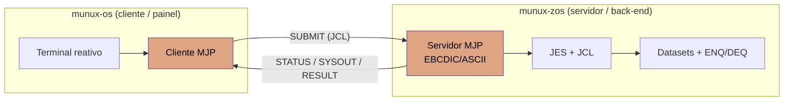

# O Ecossistema Munux

Munux é um **ecossistema de sistemas operacionais construídos do zero**. Em vez de um SO
monolítico que tenta ser tudo, são **flavors** — cada um cirúrgico para uma classe de
problema — unidos por uma filosofia comum (transparência radical, aprender construindo) e
conectados por uma **ponte de integração de alto nível**, não por fusão de código.

## Os dois mundos

| | **munux-os** | **munux-zos** |
|---|---|---|
| Papel | Workspace reativo, propósito geral | Back-end transacional (mainframe-inspired) |
| Foco | Interatividade, latência baixa, POSIX-like | Batch pesado, integridade, serialização |
| Analogia | O painel de controle | O processador de transações |
| Arquitetura | x86 (i686) | a decidir (s390x autêntico vs x86 compartilhada) |
| Status | v0.3 (kernel poliglota C/ASM/Rust) | esqueleto (projeto) |
| Entrada | [munux-os/](../munux-os/) | [munux-zos/](../munux-zos/) |

A decisão de **manter separado** é arquitetural: fundir um SO de propósito geral com um
mainframe diluiria o propósito de ambos. Ferramentas diferentes para problemas diferentes.

## A ponte: conectar, não fundir

O que dá valor ao conjunto não é rodar um mainframe dentro de um PC — é **integrar os dois
mundos**, reproduzindo a dor real do mercado corporativo: fazer o sistema moderno conversar
com o _core_ transacional que roda em mainframe.



- **munux-os** é o **cliente**: submete jobs (estilo JCL) e consome resultados.
- **munux-zos** é o **servidor**: executa jobs com disciplina de mainframe.
- O contrato é o **MJP (Munux Job Protocol)** — binário, de baixo nível, com tradução
  EBCDIC↔ASCII na borda e validação _Zero Trust_ de todo frame recebido.

Especificação completa: [munux-zos/docs/PROTOCOL.md](../munux-zos/docs/PROTOCOL.md).

## Por que isso importa (posicionamento)

Um clone de SO isolado concorre com milhares de micro-kernels. Um ecossistema **integrado**
demonstra domínio de:

- **Sistemas distribuídos e comunicação de baixo nível** (a ponte MJP).
- **Concorrência e processamento de dados massivos** (disciplina de mainframe).
- **A mentalidade moderna (Rust/TUI) unida à robustez da velha guarda (mainframe)**.

## Princípios compartilhados

1. **Do zero, sem esconder complexidade** — o código é para ser lido e estudado.
2. **Segurança por design** — todo input externo é hostil; validação na borda.
3. **Ferramenta certa para o problema certo** — nada de "Frankenstein conceitual".
4. **Fatos, não achismo** — cada flavor é fundamentado em conceitos reais e verificáveis
   (Unix/Linux no munux-os; JES/JCL/VSAM/GRS no munux-zos), reimplementados em escala
   didática.

## Organização do repositório

Ver [STRUCTURE.md](STRUCTURE.md) para a árvore completa. Em resumo:

```
Munux/
├── README.md          # porta de entrada do ecossistema
├── docs/              # docs do PROJETO INTEIRO (ECOSYSTEM.md, STRUCTURE.md)
├── munux-os/          # flavor 1 — kernel de propósito geral (x86)
│   └── docs/          # docs SÓ do munux-os (kernel, memória, drivers, …)
└── munux-zos/         # flavor 2 — back-end mainframe-inspired (esqueleto)
    └── docs/          # docs SÓ do munux-zos (roadmap, arquitetura, MJP)
```

A documentação segue três níveis, sem mistura:

- **`docs/` (raiz)** — só o que é do ecossistema como um todo (esta visão e a estrutura).
- **`munux-os/docs/`** — tudo específico do kernel de propósito geral.
- **`munux-zos/docs/`** — tudo específico do back-end inspirado em mainframe.
