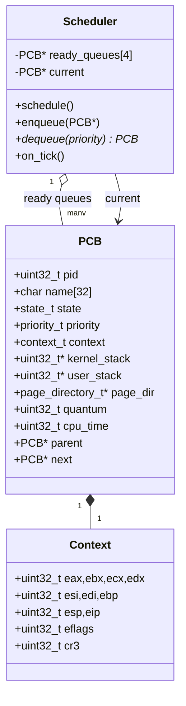
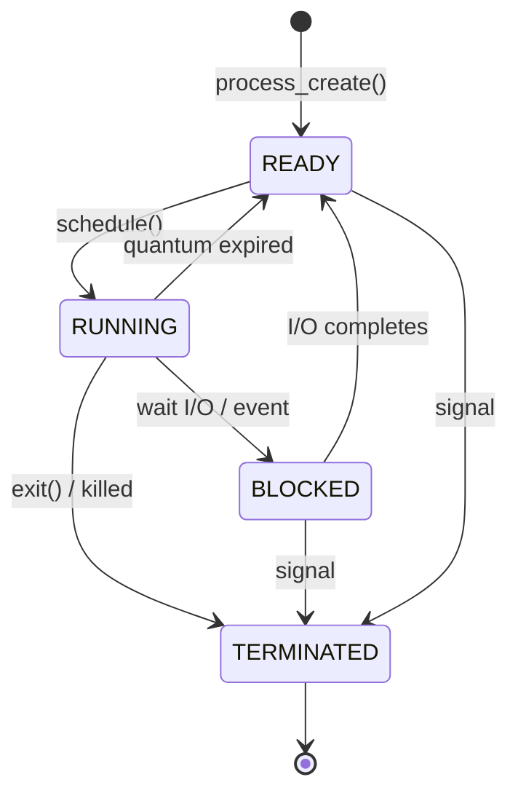

# Process Management and Scheduling

## Overview

Munux implements full preemptive multitasking, allowing multiple processes to share the CPU through rapid context switching. This creates the illusion of parallelism even on single-core systems.

## UML Class Diagram — PCB and Scheduler



## UML State Diagram — Process Lifecycle



## UML Sequence — Timer-Driven Context Switch

```mermaid
sequenceDiagram
    autonumber
    participant PIT
    participant ISR as IRQ0 stub
    participant Disp as irq_handler
    participant TMR as timer_callback
    participant S as scheduler
    participant SW as switch_to (asm)

    PIT->>ISR: IRQ0 raise
    ISR->>Disp: save regs, call dispatcher
    Disp->>TMR: timer_callback(regs)
    TMR->>TMR: ticks++; current->quantum--
    alt quantum > 0
        TMR-->>Disp: return
    else quantum == 0
        TMR->>S: schedule()
        S->>S: enqueue(current)
        S->>S: pick highest non-empty prio queue
        S->>SW: switch_to(old_ctx, new_ctx)
        SW-->>S: ret as new process
    end
    Disp->>ISR: EOI to PIC, iret
```

## Process Control Block (PCB)

### Structure

Each process is represented by a Process Control Block containing all information needed to manage the process:

**Identification**: A unique process ID (PID) distinguishes each process. PIDs are assigned sequentially starting from 1. The process name provides a human-readable identifier.

**State**: The current state determines what the process can do:
- READY: Eligible to run, waiting in a queue
- RUNNING: Currently executing on the CPU
- BLOCKED: Waiting for I/O or event
- TERMINATED: Finished execution

**Context**: The CPU context captures the complete processor state at the point where the process was suspended:
- General purpose registers (EAX, EBX, ECX, EDX, ESI, EDI, EBP)
- Stack pointer (ESP)
- Instruction pointer (EIP)
- Flags register (EFLAGS)
- Page directory pointer (CR3)

**Memory**: Each process has its own memory space:
- Kernel stack (8KB) for kernel-mode execution
- User stack (8KB) for user-mode execution
- Page directory pointing to the process's virtual address space

**Scheduling**: Information used by the scheduler:
- Priority level (LOW, NORMAL, HIGH, REALTIME)
- Remaining quantum (time slice)
- Total CPU time consumed
- Pointer to parent process

**Linkage**: The next pointer forms a linked list of all processes in the system.

### Process Creation

Creating a new process:

1. Allocate memory for the PCB structure
2. Assign a unique PID
3. Copy the process name
4. Allocate kernel and user stacks
5. Create or clone a page directory
6. Initialize CPU context with entry point
7. Set initial state to READY
8. Add to the global process list

The CPU context is initialized so that when the process first runs, it will begin executing at the specified entry point function with a valid stack.

### Process Termination

Terminating a process:

1. Mark state as TERMINATED
2. Remove from ready queues
3. Free allocated stacks
4. Free page directory and mapped pages
5. Free the PCB structure
6. If this was the current process, invoke the scheduler

Resources must be carefully freed in the correct order to avoid leaks or dangling pointers.

## Scheduling Algorithm

### Round-Robin with Priorities

The scheduler implements round-robin scheduling with four priority levels. Higher priority processes execute before lower priority ones, but all processes at the same priority share the CPU equally.

### Priority Queues

Four separate queues hold ready processes, one per priority level:
- Queue 0: LOW priority
- Queue 1: NORMAL priority  
- Queue 2: HIGH priority
- Queue 3: REALTIME priority

Each queue is circular, with the tail pointing back to the head. This simplifies rotation when moving through processes.

### Quantum

Each process receives a quantum when scheduled, representing the maximum time it can execute before being preempted. The default quantum is 10 timer ticks (100ms at 100Hz timer frequency).

On each timer tick:
1. Decrement the current process's quantum
2. If quantum reaches zero, invoke the scheduler
3. Otherwise, continue running the current process

This preemptive approach ensures no process can monopolize the CPU indefinitely.

### Scheduling Decision

When the scheduler runs:

1. Save the current process back to its ready queue (if still runnable)
2. Check priority queues from highest to lowest
3. Select the next process from the first non-empty queue
4. Remove it from the queue
5. Set its state to RUNNING
6. Restore its quantum to the default value
7. Perform a context switch

If all queues are empty, the idle process runs, which simply halts until an interrupt occurs.

### Fairness

Within each priority level, processes execute in strict round-robin order. Each process runs for its full quantum before the next process gets a turn.

Across priority levels, higher priorities dominate. A REALTIME process will always execute before NORMAL processes, regardless of how long those processes have been waiting.

This priority model suits systems with a few important tasks (like device drivers) that need quick response times, while bulk processing happens at lower priorities.

## Context Switching

### Save/Restore

Context switching is the core mechanism that enables multitasking. It consists of:

1. Saving the current process's CPU state to its PCB
2. Loading the next process's CPU state from its PCB

### Assembly Implementation

Context switching must be implemented in assembly language for precise control over CPU state:

```
switch_to_process(old_context, new_context):
    # Save old process state
    Save all general-purpose registers to old_context
    Save ESP, EIP, EFLAGS to old_context
    Save CR3 to old_context
    
    # Restore new process state
    Load all general-purpose registers from new_context
    Load ESP, EIP, EFLAGS from new_context
    Load CR3 from new_context (if different)
    
    # Return causes jump to new process's EIP
    ret
```

The save step captures everything needed to resume the old process later. The restore step sets up the CPU so the new process continues exactly where it left off.

### Page Directory Switching

When processes have different page directories, CR3 must be updated. This single register write changes the entire virtual memory space.

To optimize, the context switcher compares CR3 values and skips the write if both processes use the same page directory (currently, all processes share the kernel directory, but this will change when implementing user mode).

### Stack Switching

Each process has its own kernel stack, allowing multiple processes to simultaneously be "in the kernel" (e.g., blocked on I/O). The context switch updates ESP to point to the new process's stack.

### Timing

Context switches must be fast to minimize overhead. The current implementation takes approximately:
- 50-100 CPU cycles to save registers
- 50-100 cycles to restore registers  
- 1000+ cycles if TLB flush required

At 100Hz scheduling frequency, context switch overhead is well under 1% of total CPU time.

## Idle Process

### Purpose

The idle process runs when no other process is ready. Its sole function is to halt the CPU until the next interrupt arrives.

```c
void idle_task(void) {
    while (1) {
        __asm__ volatile("hlt");
    }
}
```

The HLT instruction stops execution until an interrupt occurs. This saves power compared to busy-waiting.

### Scheduling

The idle process runs at LOW priority and has PID 0. It's created during system initialization and never terminates.

If the scheduler finds all queues empty, it selects the idle process by default.

## Synchronization

### Critical Sections

Some kernel code must not be interrupted to maintain consistency. Critical sections disable interrupts:

```c
cli();  // Clear interrupt flag
// ... critical code ...
sti();  // Set interrupt flag
```

This is a heavyweight synchronization mechanism used sparingly.

### Future Enhancements

Proper synchronization primitives are planned:
- Mutexes for mutual exclusion
- Semaphores for counting resources
- Condition variables for event notification
- Read-write locks for shared data structures

These will enable safe concurrent access to shared resources without disabling all interrupts.

## Inter-Process Communication

### Current State

The current implementation lacks IPC mechanisms. Processes cannot directly communicate or share data.

### Planned Features

Future IPC mechanisms will include:

**Signals**: Asynchronous notifications like UNIX signals

**Pipes**: Unidirectional byte streams between processes

**Message Queues**: Structured message passing

**Shared Memory**: Explicit memory regions mapped into multiple address spaces

**Sockets**: Network-style communication for local or remote processes

## Process States and Transitions

State transitions occur as follows:

**READY → RUNNING**: Scheduler selects process to execute

**RUNNING → READY**: Quantum expires, process preempted

**RUNNING → BLOCKED**: Process waits for I/O

**BLOCKED → READY**: I/O completes, process can continue

**RUNNING → TERMINATED**: Process exits normally

**Any state → TERMINATED**: Process killed by error or signal

The scheduler manages these transitions, ensuring processes move through states correctly.

## Future Enhancements

Several advanced features are planned:

**User Mode**: Currently all processes run in kernel mode. Implementing user mode with ring separation will improve security and stability.

**Copy-on-Write**: When forking processes, pages can be shared with copy-on-write semantics to save memory.

**Demand Paging**: Pages can be loaded from disk on demand rather than pre-loading entire process images.

**Process Groups**: Related processes can be managed as a unit.

**Nice Values**: Fine-grained priority adjustment for fairness tuning.

**CPU Affinity**: On multi-core systems, bind processes to specific cores.

---

**Implementation Files**:
- `kernel/process/process.c` - Process management
- `kernel/process/scheduler.c` - Scheduling algorithm
- `kernel/process/switch.asm` - Context switching
- `kernel/process/process.h` - Public API definitions
