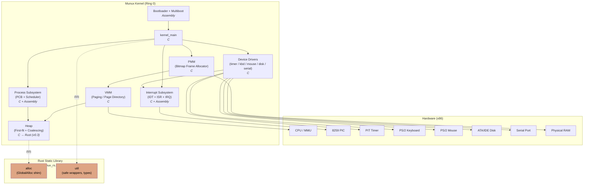

# Sistema Operacional Munux — Documentação Técnica

## Visão Geral

O Munux é um sistema operacional moderno e educacional projetado do zero para oferecer tanto funcionalidade poderosa quanto oportunidades profundas de aprendizado. Construído sobre a arquitetura x86, o Munux implementa conceitos fundamentais de SO, incluindo gerenciamento de memória, escalonamento de processos, tratamento de interrupções e drivers de dispositivo.

A filosofia do projeto se concentra em transparência e compreensão — cada componente é projetado para ser compreensível, mantendo ao mesmo tempo padrões de código de qualidade de produção.

## Linguagens de Implementação

O Munux é um kernel poliglota, com cada linguagem atribuída à camada onde ela agrega mais valor:

| Linguagem | Papel | Justificativa |
|---|---|---|
| **Assembly x86 (NASM)** | Bootloader, cabeçalho multiboot, stubs de interrupção, troca de contexto | Controle direto do hardware e precisão em nível de instrução, onde nenhuma abstração é aceitável |
| **C (C99, freestanding)** | Subsistemas centrais — IDT, PMM, VMM, heap, scheduler, drivers | ABI previsível, toolchain freestanding madura, décadas de literatura de SO para aproveitar |
| **Rust (no_std, edição 2021)** | Componentes novos e sensíveis à memória, vinculados como biblioteca estática | Segurança de memória em tempo de compilação, sistema de tipos forte, primitivas de concorrência sem medo — sem runtime |

A camada Rust é **aditiva**: ela é compilada como biblioteca estática `no_std` e vinculada ao ELF do kernel junto com os objetos em C e Assembly. Não há runtime de Rust, não há `std`, nem alocador além do que o próprio kernel fornece. Veja [RUST.md](RUST.md) para o modelo completo de integração.

## Visão Geral do Sistema (Diagrama de Componentes UML)

O diagrama abaixo mostra os componentes de topo do kernel e as dependências entre eles. As setas apontam do consumidor para o provedor — por exemplo, o Heap depende do VMM, que por sua vez depende do PMM.



As arestas tracejadas denotam a fronteira FFI entre C e Rust. A crate Rust é vinculada estaticamente ao `kernel.elf`; do lado do C, ela é indistinguível de qualquer outro arquivo-objeto no link.

## Arquitetura

O Munux segue uma arquitetura de kernel monolítico, onde todos os serviços centrais (gerenciamento de memória, escalonamento de processos, drivers de dispositivo) rodam em modo kernel com acesso total ao hardware. Essa escolha de projeto prioriza desempenho e clareza de aprendizado em detrimento dos benefícios de isolamento das arquiteturas de microkernel.

### Componentes do Sistema

O kernel é organizado em vários subsistemas:

**Gerenciamento de Interrupções**: A Interrupt Descriptor Table (IDT) fornece a base para a comunicação com o hardware e o tratamento de exceções. Todos os 256 vetores de interrupção são configurados adequadamente, com as exceções de CPU mapeadas para 0-31 e as IRQs de hardware remapeadas para 32-47 para evitar conflitos.

**Gerenciamento de Memória**: Um sistema de memória de três camadas cuida de tudo, desde a alocação de frames físicos até operações de heap de alto nível. O Gerenciador de Memória Física rastreia frames de 4KB usando uma estrutura de bitmap eficiente. O Gerenciador de Memória Virtual implementa paginação com um page directory e page tables, habilitando proteção de memória e espaços de endereçamento virtual. O alocador de heap fornece alocação dinâmica de memória por meio das primitivas malloc/free, usando uma estratégia first-fit com coalescência de blocos.

**Gerenciamento de Processos**: Suporte completo a multitarefa por meio de uma estrutura Process Control Block que mantém o estado, o contexto, a prioridade e as informações de memória do processo. O scheduler round-robin com níveis de prioridade garante distribuição justa da CPU, ao mesmo tempo em que permite que tarefas importantes sejam executadas preferencialmente.

**Drivers de Dispositivo**: Abstração de hardware de baixo nível para periféricos essenciais, incluindo o Programmable Interval Timer para escalonamento baseado em tempo, um driver de teclado PS/2 completo com tradução de scancodes e suporte a teclas modificadoras, driver de mouse PS/2 com suporte a três botões, controlador de disco ATA/IDE para acesso a armazenamento em massa e driver de porta serial para depuração e comunicação externa.

**Biblioteca Estática Rust**: Uma crate Rust `no_std` compilada em `libmunux_rs.a` e vinculada ao ELF do kernel. Ela expõe uma API `extern "C"` consumida pelo núcleo em C. O escopo inicial (v0.3) cobre um alocador de heap seguro e tipos utilitários compartilhados; fases posteriores portarão incrementalmente subsistemas adicionais onde a segurança de memória oferece maior alavancagem.

## Layout de Memória

O kernel usa um layout de memória cuidadosamente planejado para evitar conflitos e maximizar o espaço disponível:

```
0x00000000 - 0x000003FF: Real mode IVT (not used after boot)
0x00000400 - 0x000004FF: BIOS data area
0x00000500 - 0x00007BFF: Free memory (conventional)
0x00007C00 - 0x00007DFF: Bootloader
0x00007E00 - 0x0007FFFF: Free memory
0x00080000 - 0x001FFFFF: Kernel code and data
0x00100000 - 0x001FFFFF: Frame bitmap for PMM
0x00200000 - 0xBFFFFFFF: Available for allocation
0xC0000000 - 0xCFFFFFFF: Kernel heap
0xD0000000 - 0xFFFFFFFF: Reserved/Memory mapped I/O
```

A memória física é gerenciada em páginas de 4KB, com os primeiros 2MB reservados para uso do kernel. A memória virtual permite que cada processo tenha seu próprio espaço de endereçamento, ao mesmo tempo em que compartilha o código do kernel.

## Processo de Boot

O diagrama de sequência UML a seguir mostra as interações ordenadas entre firmware, bootloader e subsistemas do kernel durante a inicialização do sistema.

```mermaid
sequenceDiagram
    autonumber
    participant BIOS
    participant Boot as Bootloader (0x7C00)
    participant K as kernel_main
    participant IDT as IDT/PIC
    participant Mem as PMM/VMM/Heap
    participant Drv as Drivers
    participant Sch as Scheduler

    BIOS->>Boot: Load sector 0 @0x7C00
    Boot->>Boot: Setup stack, print banner
    Boot->>Boot: Load kernel @0x80000
    Boot->>Boot: Install GDT, switch to PMode
    Boot->>K: jmp kernel_entry
    K->>IDT: idt_init() + PIC remap (32..47)
    K->>Mem: pmm_init() → vmm_init() → heap_init()
    Mem->>Mem: Enable paging (CR0.PG)
    K->>Drv: timer_init(100Hz)
    K->>Drv: keyboard/mouse/serial/disk init
    K->>Sch: process_init() + idle task
    Sch-->>K: sti; await first tick
    Note over Sch,Drv: Multitasking active
```

A inicialização do sistema segue uma sequência cuidadosamente orquestrada:

A BIOS carrega o bootloader do primeiro setor do dispositivo de boot para a memória em 0x7C00. O bootloader inicializa a CPU, configura uma stack mínima e exibe as mensagens iniciais. Em seguida, ele carrega o kernel a partir dos setores subsequentes do disco para a memória em 0x80000.

Após carregar o kernel, o bootloader configura a Global Descriptor Table para operação em modo protegido e faz a CPU transitar do modo real de 16 bits para o modo protegido de 32 bits. Por fim, ele transfere o controle para o ponto de entrada do kernel.

O kernel começa inicializando a Interrupt Descriptor Table e configurando o Programmable Interrupt Controller. Os subsistemas de gerenciamento de memória iniciam em seguida — primeiro o gerenciador de memória física, depois o heap e, por fim, a memória virtual com a paginação habilitada.

Os drivers de hardware inicializam em ordem de dependência: o timer primeiro, por ser necessário ao scheduler, depois o teclado, a porta serial, o mouse e o controlador de disco. Por fim, o sistema de gerenciamento de processos e o scheduler são ativados, habilitando a multitarefa.

## Tratamento de Interrupções

O sistema de interrupções forma a espinha dorsal da interação com o hardware e do gerenciamento de exceções. A IDT contém 256 entradas, cada uma descrevendo como tratar uma interrupção específica.

As exceções de CPU (0-31) tratam condições de erro como divisão por zero, page faults e general protection faults. Cada exceção tem um handler dedicado que pode registrar informações de diagnóstico ou encerrar processos que se comportam mal.

As interrupções de hardware (32-47) são geradas por dispositivos físicos. O Programmable Interrupt Controller é reprogramado para evitar conflitos com as exceções de CPU. Interrupções de hardware comuns incluem os ticks do timer na IRQ0, a entrada do teclado na IRQ1 e os eventos de mouse na IRQ12.

Quando uma interrupção dispara, a CPU salva automaticamente o estado atual e salta para o handler especificado na IDT. O handler preserva todos os registradores, realiza o trabalho necessário, envia um sinal de fim de interrupção ao PIC e retorna ao código interrompido.

## Escalonamento de Processos

O Munux implementa multitarefa preemptiva usando um scheduler round-robin com níveis de prioridade. Cada processo tem um quantum (fatia de tempo) durante o qual pode executar antes de ser preemptado.

O Process Control Block armazena todas as informações necessárias para suspender e retomar um processo: registradores da CPU, ponteiros de stack, page directory, nível de prioridade e estatísticas de escalonamento.

Quatro filas de prioridade mantêm os processos prontos, com as prioridades mais altas recebendo preferência. Quando um processo esgota seu quantum, a interrupção do timer aciona o scheduler para selecionar o próximo processo.

A troca de contexto preserva o estado completo da CPU do processo que sai, enquanto restaura o estado do processo que entra. Isso inclui registradores de propósito geral, ponteiros de stack, o instruction pointer, as flags e o registrador CR3 que aponta para o page directory do processo.

## Implementação do Gerenciamento de Memória

O gerenciamento de memória física usa um bitmap onde cada bit representa um frame de 4KB. Essa representação compacta requer apenas 1KB de bitmap por 32MB de RAM. A alocação varre em busca de bits limpos, enquanto a liberação simplesmente limpa o bit correspondente.

A memória virtual mapeia endereços virtuais para frames físicos por meio de uma estrutura de page table de dois níveis. O page directory contém 1024 entradas, cada uma apontando para uma page table. Cada page table contém 1024 page table entries que mapeiam páginas individuais de 4KB.

O alocador de heap mantém uma lista encadeada de blocos, cada um marcado com seu tamanho e status de alocação. A alocação busca o primeiro bloco livre grande o suficiente para satisfazer a requisição. Blocos livres são coalescidos com blocos livres adjacentes para evitar fragmentação.

## Arquitetura dos Drivers de Dispositivo

Todos os drivers de dispositivo seguem um padrão consistente: inicialização, registro de interrupção e operação. Cada driver encapsula detalhes específicos do hardware por trás de uma API limpa.

O driver do timer programa o Programmable Interval Timer para gerar interrupções em uma frequência especificada. Cada tick incrementa um contador usado para a marcação de tempo e aciona o scheduler para preempção.

O driver de teclado traduz scancodes de hardware em caracteres ASCII, tratando teclas modificadoras, Caps Lock e fornecendo um fluxo de entrada bufferizado. O buffer circular garante que as teclas pressionadas não sejam perdidas mesmo que o processamento seja atrasado.

O driver de mouse interpreta pacotes do protocolo PS/2 contendo deltas de movimento e estados dos botões, mantendo uma posição absoluta e notificando os listeners sobre as mudanças.

O driver de disco implementa transferências básicas ATA/IDE em modo PIO, permitindo operações de leitura e escrita em nível de setor. Isso fornece a base para a implementação de um sistema de arquivos.

## Tratamento de Erros

O sistema implementa múltiplas camadas de detecção e tratamento de erros. As exceções de CPU são capturadas e registradas com informações de diagnóstico. Acessos inválidos à memória disparam page faults que podem encerrar processos. Verificações de ponteiro NULL previnem erros comuns de programação.

Os drivers de dispositivo validam todos os parâmetros e tratam condições de timeout de forma elegante. O driver de porta serial pode ser usado para registrar erros mesmo quando a saída de vídeo está indisponível.

## Considerações de Desempenho

O kernel é projetado para desempenho razoável em hardware modesto. O alocador de memória por bitmap tem tempo de alocação O(n), mas desalocação rápida O(1). O alocador de heap usa first-fit para equilibrar velocidade e fragmentação.

O scheduler round-robin fornece distribuição justa da CPU com baixo overhead. As trocas de contexto são implementadas em assembly enxuto para minimizar a latência.

Os handlers de interrupção são mantidos curtos, realizando apenas o trabalho essencial antes de retornar. Operações mais longas são adiadas para o contexto de processo sempre que possível.

## Arquitetura de Integração do Rust

A camada Rust segue um conjunto rígido de regras arquiteturais que preservam a ABI C existente e mantêm o kernel compilável mesmo que a toolchain Rust esteja indisponível para tarefas incidentais (a build de produção, no entanto, a exige).

**Unidade de compilação**: Um único workspace Cargo em `munux-os/kernel/rust/` produz uma biblioteca estática (`libmunux_rs.a`). A biblioteca é compilada com `--target i686-unknown-none` usando uma especificação de target customizada que desabilita o ponto flutuante de hardware, define o modelo de dados como `ilp32` e corresponde à ABI C usada pelo restante do kernel.

**Modelo de linkagem**: A biblioteca estática Rust é tratada como par dos arquivos-objeto em C durante a invocação final do `ld`. Os símbolos que cruzam a fronteira são declarados como `#[no_mangle] pub extern "C" fn …` no lado Rust e `extern …` no lado C, com a geração de headers automatizada via `cbindgen`.

**Contrato do alocador**: O `core::alloc::GlobalAlloc` do Rust é implementado por um shim fino que redireciona para os já existentes `kmalloc` / `kfree` do kernel. Isso permite que os módulos Rust usem `alloc::boxed::Box`, `alloc::vec::Vec` e tipos similares sem introduzir um segundo heap.

**Política de panic**: É fornecido um `#[panic_handler]` que roteia através de `serial_writestring` e então trava a CPU pelo caminho de panic existente do kernel, de modo que um panic de Rust se manifesta de forma idêntica a uma chamada `panic()` em C.

**Política de segurança**: A raiz da crate define `#![forbid(unsafe_op_in_unsafe_fn)]` e `#![deny(clippy::undocumented_unsafe_blocks)]`. Todos os blocos `unsafe` são confinados à camada de shim FFI (`ffi/`) e devem carregar um comentário `// SAFETY:` documentando o invariante do qual se depende.

Para a estratégia completa, a ordem de portabilidade e as convenções de FFI, veja [RUST.md](RUST.md).

## Desenvolvimento Futuro

A implementação atual fornece uma base sólida para recursos avançados. As melhorias planejadas incluem uma camada de abstração de sistema de arquivos virtual, suporte ao sistema de arquivos ext2, modo usuário com separação de rings, interface de chamadas de sistema, carregamento de executáveis ELF, biblioteca C freestanding, pilha de rede e interface gráfica de usuário. A adoção do Rust (v0.3) é a predecessora imediata desses recursos de serviços de sistema e ajudará a definir quais subsistemas futuros serão escritos em Rust desde o início, em vez de portados a partir do C.

---

**Autora**: Munique Feitoza  
**Licença**: GPLv3  
**Repositório**: https://github.com/Munique-Feitoza/Munux
