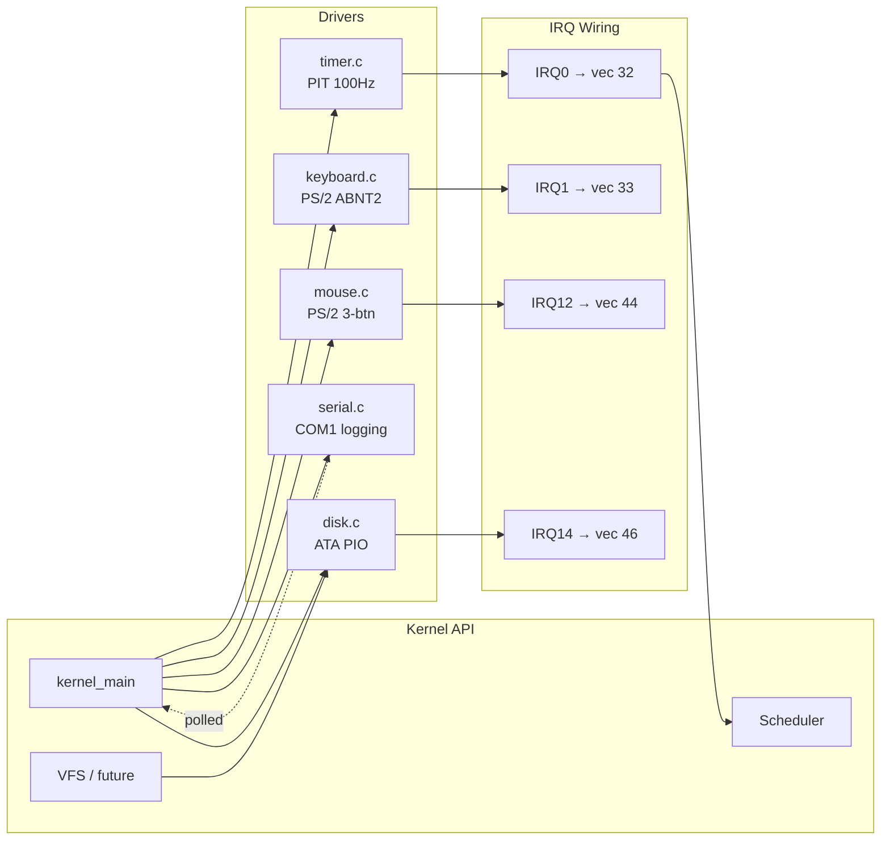
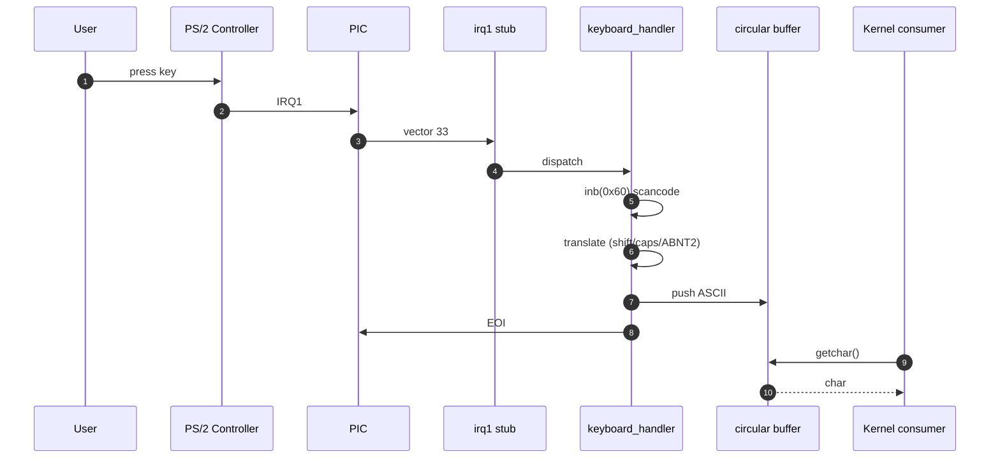

# Drivers de Dispositivo

## Visão Geral

Drivers de dispositivo fornecem camadas de abstração entre o hardware e os subsistemas do kernel. Cada driver encapsula os detalhes específicos do dispositivo por trás de uma interface limpa e consistente.

## Diagrama de Componentes UML — Camada de Drivers

Todos os drivers compartilham um formato comum: um ponto de entrada `*_init()` que programa o dispositivo, um handler de IRQ registrado na IDT e (opcionalmente) uma API de leitura/escrita exposta ao resto do kernel.



## Sequência UML — Caminho de uma Tecla do Teclado



## Driver de Timer (PIT)

### Temporizador de Intervalo Programável

O PIT 8253/8254 gera interrupções periódicas para marcação de tempo e escalonamento. O chip contém três contadores independentes, mas usamos apenas o canal 0.

### Configuração

O oscilador do PIT opera a 1.193182 MHz. Para gerar interrupções em uma frequência desejada:

1. Calcule divisor = 1193182 / frequência_desejada
2. Envie o byte de modo/comando para a porta 0x43
3. Envie o byte baixo do divisor para a porta 0x40
4. Envie o byte alto do divisor para a porta 0x40

O byte de modo configura o canal 0 para o modo gerador de taxa (modo 2), que produz uma saída em onda quadrada adequada para interrupções.

### Inicialização

Inicialização do timer:

```c
void timer_init(uint32_t frequency) {
    register_interrupt_handler(32, timer_callback);
    
    uint32_t divisor = 1193182 / frequency;
    outb(0x43, 0x36);  // Command: channel 0, lobyte/hibyte, mode 2
    outb(0x40, divisor & 0xFF);
    outb(0x40, (divisor >> 8) & 0xFF);
}
```

Normalmente configuramos 100 Hz (período de 10ms) para uma granularidade de escalonamento razoável sem overhead excessivo.

### Handler de Interrupção

O handler do timer incrementa um contador de ticks a cada interrupção:

```c
static volatile uint32_t timer_ticks = 0;

static void timer_callback(struct registers* regs) {
    timer_ticks++;
}
```

O qualificador volatile garante que o compilador não otimize e elimine acessos a essa variável compartilhada.

### Marcação de Tempo

Funções de temporização de mais alto nível usam o contador de ticks:

**Obter o Tempo Atual**: Simplesmente retorna a contagem de ticks

**Sleep/Wait**: Faz loop até que os ticks atinjam o valor alvo, colocando a CPU em halt entre as verificações

**Tempo Decorrido**: Subtrai a contagem de ticks inicial da contagem atual

Para temporização precisa, múltiplos canais do PIT ou outros timers (HPET, TSC) podem ser usados.

## Driver de Teclado

### Controlador PS/2

O teclado se conecta através do controlador PS/2, uma interface legada ainda emulada em sistemas modernos. O controlador tem duas portas (teclado e mouse) compartilhando linhas de interrupção.

### Scancodes

Quando uma tecla é pressionada ou solta, o teclado envia um byte de scancode. Diferentes layouts de teclado usam diferentes conjuntos de scancodes, mas assumimos o Set 1 (o mais comum).

Cada tecla possui:
- Make code: Enviado quando a tecla é pressionada  
- Break code: Enviado quando a tecla é solta (make code | 0x80)

Teclas especiais enviam sequências de múltiplos bytes, mas implementamos o tratamento de byte único por simplicidade.

### Tradução de Scancode

O driver inclui tabelas de lookup que mapeiam scancodes para caracteres ASCII:

```c
static const char scancode_to_ascii[] = {
    0, ESC, '1', '2', '3', '4', '5', '6', '7', '8', '9', '0', ...
};

static const char scancode_to_ascii_shift[] = {
    0, ESC, '!', '@', '#', '$', '%', '^', '&', '*', '(', ')', ...
};
```

Duas tabelas tratam os caracteres sem shift e com shift.

### Teclas Modificadoras

Tratamento especial para teclas modificadoras:

**Shift**: Shift esquerdo/direito ativam uma flag que afeta a tradução de caracteres

**Ctrl**: Ativa a flag, mas a tradução de caracteres ainda não está implementada

**Alt**: Ativa a flag para uso futuro

**Caps Lock**: Alterna a flag ao pressionar (não ao soltar), afeta a caixa das letras

O estado dos modificadores persiste entre os pressionamentos de tecla até ser alterado.

### Buffer de Entrada

Um buffer circular armazena os caracteres recebidos:

```c
static char keyboard_buffer[256];
static volatile uint32_t buffer_read_pos = 0;
static volatile uint32_t buffer_write_pos = 0;
```

O handler de interrupção escreve caracteres no buffer. O código da aplicação lê a partir dele. A estrutura circular previne overflow do buffer fazendo o wrap dos índices módulo o tamanho do buffer.

### Handler de Interrupção

Na IRQ1:

1. Ler o scancode da porta 0x60
2. Verificar o bit alto para detectar pressionamento/liberação
3. Atualizar o estado dos modificadores se for uma tecla modificadora
4. Traduzir o scancode para ASCII usando o estado atual dos modificadores
5. Adicionar o caractere ao buffer circular

Teclas especiais (setas, teclas de função) usam códigos estendidos acima de 127.

### Interface Pública

As aplicações acessam o teclado através de:

**keyboard_getchar()**: Leitura bloqueante do próximo caractere

**keyboard_available()**: Verifica se há caracteres no buffer

**keyboard_flush()**: Limpa o buffer

**keyboard_get_state()**: Consulta o estado das teclas modificadoras

Essa abstração oculta os detalhes de hardware do código de mais alto nível.

## Driver de Mouse

### Protocolo PS/2 do Mouse

O mouse envia pacotes de três bytes contendo:
- Byte 0: Estados dos botões e bits de sinal de movimento
- Byte 1: Delta de movimento em X (-256 a +255)
- Byte 2: Delta de movimento em Y (-256 a +255)

Existem extensões para rodas de rolagem e botões extras, mas implementamos o suporte básico de três botões.

### Inicialização

A inicialização do mouse é mais complexa que a do teclado:

1. Habilitar o dispositivo auxiliar no controlador PS/2
2. Configurar o controlador para rotear a IRQ12
3. Enviar o comando "set defaults" ao mouse
4. Enviar o comando "enable data reporting"
5. Aguardar a confirmação após cada comando

O controlador do mouse usa portas de comando e dados separadas das do teclado.

### Montagem de Pacotes

O handler de interrupção monta os pacotes completos:

```c
static uint8_t mouse_cycle = 0;
static int8_t mouse_byte[3];

static void mouse_handler(struct registers* regs) {
    mouse_byte[mouse_cycle++] = inb(0x60);
    
    if (mouse_cycle == 3) {
        mouse_cycle = 0;
        process_packet(mouse_byte);
    }
}
```

Somente quando todos os três bytes chegam é que processamos o pacote.

### Processamento de Movimento

Para extrair os deltas de movimento:

1. Ler o byte 1 e o byte 2
2. Verificar os bits de status para extensão de sinal
3. Se o bit de sinal estiver ativo, estender para um valor negativo de 32 bits
4. Inverter o eixo Y (o PS/2 tem o Y invertido)
5. Atualizar a posição absoluta
6. Extrair os estados dos botões do byte 0
7. Chamar o callback registrado com o delta e os botões

Callbacks permitem que o código de mais alto nível (GUI, cursor) responda a eventos do mouse sem polling.

### Gerenciamento do Cursor

Código futuro de GUI usará a entrada do mouse para:
- Atualizar a posição do cursor na tela
- Detectar cliques em elementos de UI  
- Implementar drag-and-drop
- Tratar eventos de rolagem

## Driver de Porta Serial

### Comunicação RS-232

Portas seriais fornecem comunicação assíncrona com dispositivos externos. Embora amplamente substituídas por USB, a serial ainda é útil para:
- Depuração via console serial
- Comunicação com dispositivos embarcados
- Suporte a hardware legado

### Registradores UART

Cada porta serial (COM1-COM4) possui um conjunto de portas de I/O:

**Registrador de Dados (0x3F8)**: Transmite/recebe bytes

**Interrupt Enable (0x3F9)**: Habilita a geração de interrupções

**Interrupt ID (0x3FA)**: Identifica a origem da interrupção

**Line Control (0x3FB)**: Configura o formato dos dados

**Modem Control (0x3FC)**: Controla os sinais do modem

**Line Status (0x3FD)**: Verifica o status de transmissão/recepção

**Modem Status (0x3FE)**: Lê os sinais do modem

**Scratch (0x3FF)**: Registrador de rascunho não utilizado

### Inicialização

Configuração da porta serial:

1. Desabilitar interrupções
2. Habilitar o DLAB (Divisor Latch Access Bit)
3. Definir o divisor de baud rate (38400 baud típico)
4. Configurar 8N1 (8 bits, sem paridade, 1 stop bit)
5. Habilitar e limpar o FIFO
6. Definir os sinais de modem control
7. Testar com loopback
8. Definir o modo operacional normal

Após a inicialização, a porta está pronta para transmitir/receber.

### Transmissão

Para enviar um byte:

1. Aguardar o buffer de transmissão ficar vazio (bit 5 do line status)
2. Escrever o byte no registrador de dados
3. O byte é transmitido automaticamente

Para strings, iterar e enviar cada caractere.

### Recepção

Para receber um byte:

1. Aguardar dados prontos (bit 0 do line status)
2. Ler o byte do registrador de dados

O FIFO faz o buffer dos dados recebidos, reduzindo a chance de overruns.

### Saída de Depuração

Portas seriais são inestimáveis para a depuração do kernel:

```c
serial_writestring(COM1, "Debug: entering function\n");
```

Diferente da saída de vídeo, a serial continua funcionando mesmo quando o vídeo está corrompido ou o sistema está em um estado estranho.

## Driver de Disco (ATA/IDE)

### Interface ATA

O ATA (AT Attachment) fornece uma interface padrão para dispositivos de armazenamento. O SATA moderno é retrocompatível com o ATA para operações básicas.

Implementamos o modo PIO (Programmed I/O), no qual a CPU lê/escreve diretamente os setores do disco. O modo DMA seria mais eficiente, porém mais complexo.

### Conjunto de Registradores

O controlador IDE primário usa as portas 0x1F0-0x1F7:

**0x1F0 (Data)**: Transferências de dados de 16 bits

**0x1F1 (Error)**: Informações de erro em comandos que falharam

**0x1F2 (Sector Count)**: Número de setores a transferir

**0x1F3-0x1F5 (LBA Low/Mid/High)**: Logical Block Address

**0x1F6 (Drive/Head)**: Seleção de drive e bits altos do LBA

**0x1F7 (Status/Command)**: Lê status, escreve comandos

### Inicialização

Inicialização do disco:

1. Selecionar o drive master (0xA0 no registrador drive/head)
2. Zerar o sector count e o LBA
3. Opcionalmente enviar o comando IDENTIFY para detectar o drive

O comando IDENTIFY retorna 256 words de informação, incluindo modelo, número de série e capacidade.

### Leitura de Setores

Para ler um setor:

1. Aguardar o drive não estar ocupado (busy)
2. Selecionar o drive e o modo LBA
3. Escrever o sector count (tipicamente 1)
4. Escrever o endereço LBA (endereçamento de 28 bits)
5. Enviar o comando READ SECTORS
6. Aguardar o drive ficar pronto
7. Aguardar a requisição de dados (DRQ)
8. Ler 256 words (512 bytes) da porta de dados

Cada word tem 16 bits, ou seja, dois bytes por chamada de inw().

### Escrita de Setores

A escrita é semelhante:

1. Aguardar o drive não estar ocupado (busy)
2. Selecionar o drive e o modo LBA
3. Escrever o sector count e o LBA
4. Enviar o comando WRITE SECTORS
5. Aguardar o drive ficar pronto e o DRQ
6. Escrever 256 words na porta de dados
7. Aguardar a conclusão

Após a escrita, o drive pode precisar de tempo para gravar fisicamente na mídia.

### Tratamento de Erros

Após os comandos, verificar o registrador de erro e as flags de status:
- O bit ERR indica que o comando falhou
- O registrador de erro contém o código de erro específico
- Timeout aguardando o DRQ sugere problema de hardware

O tratamento adequado de erros permite degradação graciosa quando os discos falham.

### Melhorias Futuras

Diversas melhorias são possíveis:

**Modo DMA**: Deixar o controlador de disco transferir dados diretamente para a memória

**LBA de 48 bits**: Suportar discos maiores que 128GB

**ATAPI**: Suportar drives de CD/DVD usando a interface de pacotes ATA

**Múltiplos Drives**: Detectar e gerenciar drives master/slave

**NCQ**: Native Command Queuing para melhor desempenho

---

**Arquivos de Implementação**:
- `kernel/drivers/timer.c/.h` - Temporizador de Intervalo Programável
- `kernel/drivers/keyboard.c/.h` - Driver de teclado PS/2
- `kernel/drivers/mouse.c/.h` - Driver de mouse PS/2
- `kernel/drivers/serial.c/.h` - Porta serial RS-232
- `kernel/drivers/disk.c/.h` - Controlador de disco ATA/IDE
