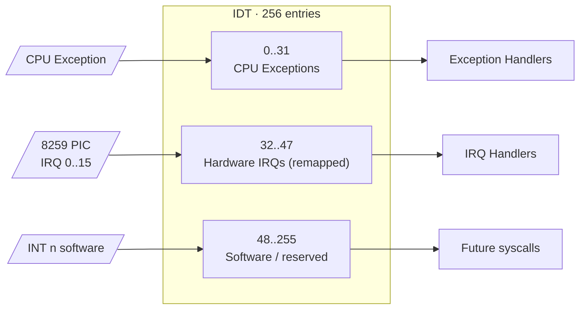
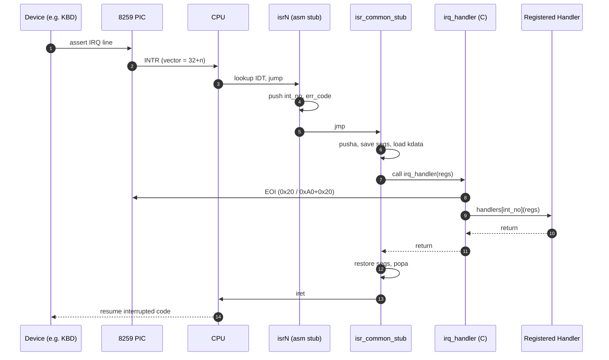
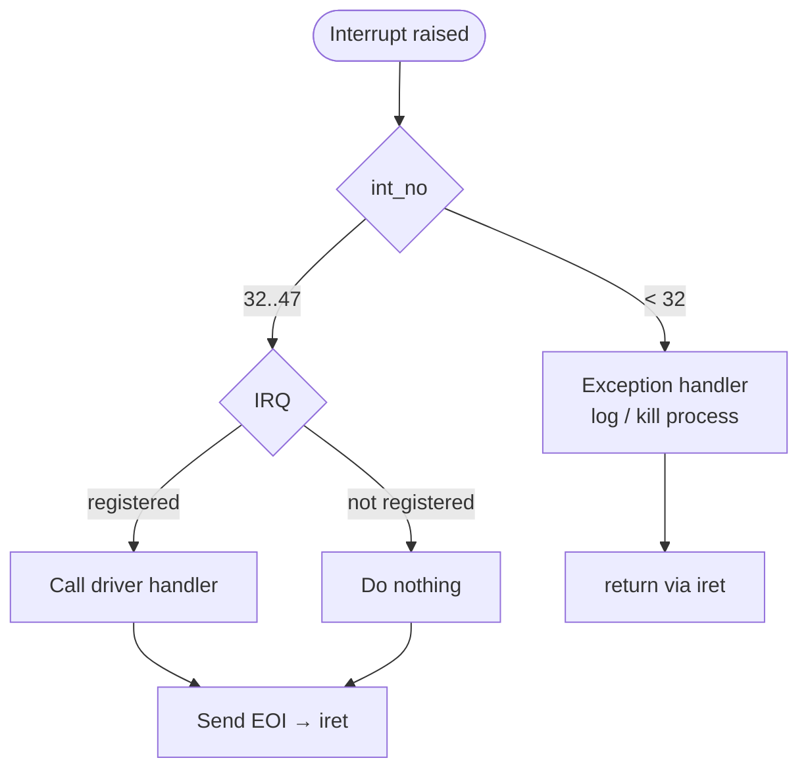

# Sistema de Tratamento de Interrupções

## Fundamentos

Interrupções são o principal mecanismo de comunicação com o hardware e de tratamento de exceções em sistemas x86. Elas permitem que dispositivos externos sinalizem a CPU e habilitam o processador a lidar com condições de erro.

## Visão Geral em UML — Layout dos Vetores da IDT



## Sequência em UML — Ciclo de Vida da Interrupção (caminho IRQ)

Fluxo de um evento de hardware (por exemplo, uma tecla pressionada no teclado) passando pelo stub em assembly até um handler de driver registrado.



## Atividade em UML — Despacho de Exceção vs IRQ



## Tabela de Descritores de Interrupção (IDT)

### Estrutura

A IDT é um array de 256 entradas, cada uma descrevendo como tratar uma interrupção específica. Cada entrada contém:

**Endereço do Handler**: ponteiro de 32 bits para a rotina de serviço de interrupção. O endereço é dividido em valores de 16 bits (baixo e alto) por questão de compatibilidade com x86.

**Seletor de Segmento**: especifica qual segmento de código contém o handler. Normalmente aponta para o segmento de código do kernel.

**Flags**: controlam atributos, incluindo:
- Tipo de descritor (interrupt gate, trap gate, task gate)
- Nível de privilégio necessário para invocar via instrução INT
- Bit de presença indicando validade

### Tipos de Interrupção

Os 256 vetores de interrupção são alocados da seguinte forma:

**Exceções da CPU (0-31)**: reservadas pela Intel para exceções geradas pelo processador. Isso inclui erros de divisão, page faults, general protection faults e outras condições de erro detectadas pelo hardware.

**IRQs de Hardware (32-47)**: interrupções de hardware remapeadas a partir do Programmable Interrupt Controller. Originalmente as IRQs 0-15 conflitam com exceções da CPU, então as remapeamos para 32-47.

**Interrupções de Software (48-255)**: disponíveis para chamadas de sistema e uso customizado. Atualmente não utilizadas, mas reservadas para expansão futura.

### Inicialização

A inicialização da IDT ocorre da seguinte forma:

1. Alocar memória para 256 entradas da IDT
2. Zerar todas as entradas para garantir comportamento determinístico
3. Configurar o Programmable Interrupt Controller para remapear as IRQs
4. Instalar handlers de exceção para todas as exceções da CPU (0-31)
5. Instalar handlers de IRQ para interrupções de hardware (32-47)
6. Carregar o endereço da IDT no registrador IDTR usando a instrução LIDT

Uma vez carregada, a CPU consulta a IDT sempre que uma interrupção ocorre.

## Programmable Interrupt Controller (PIC)

### Propósito

O 8259 PIC gerencia as requisições de interrupção de hardware vindas de dispositivos periféricos. Dois PICs são conectados em cascata para fornecer 15 linhas de IRQ utilizáveis (a IRQ2 é usada para o cascateamento).

### Remapeamento

Por padrão, o PIC mapeia as IRQs 0-15 para os vetores de interrupção 8-15, o que conflita com as exceções da CPU. Nós as remapeamos para 32-47:

1. Enviar comando de inicialização para ambos os PICs
2. Definir o offset do PIC mestre como 32
3. Definir o offset do PIC escravo como 40
4. Configurar a conexão em cascata na IRQ2
5. Definir o modo operacional como compatível com 8086/8088

Esse remapeamento é essencial para distinguir interrupções de hardware das exceções da CPU.

### Fim da Interrupção (EOI)

Após atender a uma interrupção de hardware, o handler precisa enviar um sinal de EOI para reconhecer a conclusão:

- Se IRQ 0-7: enviar EOI ao PIC mestre (porta 0x20)
- Se IRQ 8-15: enviar EOI tanto ao escravo (0xA0) quanto ao mestre (0x20)

A falha em enviar o EOI impede o PIC de entregar novas interrupções.

## Handlers de Exceção

### Exceções da CPU

Cada exceção da CPU tem uma semântica específica:

**Erro de Divisão (0)**: divisão por zero ou quociente grande demais para o destino. O handler pode registrar o erro e encerrar o processo.

**Debug (1)**: breakpoint ou single-step para depuração. O suporte futuro a debugger vai utilizar isso.

**Interrupção Não-Mascarável (2)**: falha crítica de hardware. Não pode ser desabilitada e indica um problema sério.

**Breakpoint (3)**: instrução INT3 para depuração de software. Debuggers inserem isso para pausar a execução.

**Overflow (4)**: instrução INTO detectou overflow. Raramente usada em código moderno.

**Bound Range Exceeded (5)**: instrução BOUND detectou índice fora do intervalo.

**Opcode Inválido (6)**: o decodificador de instruções encontrou um opcode desconhecido. Indica código corrompido ou arquitetura errada.

**Dispositivo Não Disponível (7)**: tentativa de usar a FPU quando ela não está disponível. O handler pode habilitar a FPU ou emular a instrução.

**Double Fault (8)**: exceção ocorreu enquanto outra exceção estava sendo tratada. Indica um bug sério no kernel. Empurra um código de erro na pilha.

**Coprocessor Segment Overrun (9)**: erro legado da FPU, não usado em processadores modernos.

**TSS Inválida (10)**: task state segment inválido durante uma troca de tarefa. Empurra um código de erro na pilha.

**Segmento Não Presente (11)**: descritor de segmento marcado como não presente. Empurra um código de erro na pilha.

**Stack Segment Fault (12)**: segmento de pilha excedeu o limite ou não está presente. Empurra um código de erro na pilha.

**General Protection Fault (13)**: violação geral de proteção, a exceção mais comum. Indica violação de privilégio, erro de segmento ou ponteiro nulo. Empurra um código de erro na pilha.

**Page Fault (14)**: acesso de memória virtual a uma página não presente ou protegida. O handler pode carregar a página do disco ou encerrar o processo. Empurra um código de erro na pilha. O CR2 contém o endereço que causou a falha.

**Erro da FPU x87 (16)**: exceção de ponto flutuante, como operação inválida, divisão por zero ou overflow.

**Alignment Check (17)**: acesso de memória desalinhado com a verificação de alinhamento habilitada. Empurra um código de erro na pilha.

**Machine Check (18)**: detecção de erro de hardware. Indica hardware com falha.

**SIMD Floating Point (19)**: exceção de ponto flutuante SSE.

### Códigos de Erro

Algumas exceções empurram um código de erro na pilha fornecendo contexto adicional. O formato do código de erro depende do tipo de exceção.

Para page faults, o código de erro indica:
- Bit 0: Present (1 = violação de proteção, 0 = página não presente)
- Bit 1: Write (1 = acesso de escrita, 0 = acesso de leitura)
- Bit 2: User (1 = modo usuário, 0 = modo kernel)
- Bit 3: Violação de bit reservado
- Bit 4: Instruction fetch

Essa informação detalhada permite que o handler de page fault responda de forma apropriada.

### Implementação do Handler

Os handlers de exceção seguem um padrão consistente:

1. O stub de entrada (assembly) salva o estado da CPU
2. Empurra o número da interrupção e o código de erro
3. Chama o dispatcher comum do handler
4. O dispatcher invoca o handler em C registrado
5. O handler em C realiza o processamento específico da exceção
6. Retorna ao dispatcher
7. O dispatcher restaura o estado da CPU
8. A instrução IRET retorna ao código interrompido

Essa abordagem em camadas separa o assembly específico da arquitetura do código C portável.

## Handlers de IRQ

### Interrupções de Hardware

Dispositivos de hardware sinalizam a CPU por meio de linhas de IRQ. IRQs comuns incluem:

**IRQ 0 (Timer)**: o Programmable Interval Timer gera interrupções periódicas para contagem de tempo e escalonamento.

**IRQ 1 (Teclado)**: o controlador de teclado PS/2 sinaliza quando há dados disponíveis.

**IRQ 2 (Cascade)**: conecta o PIC escravo ao mestre, não disponível para dispositivos.

**IRQ 3/4 (Serial)**: portas seriais COM2 e COM1 para comunicação.

**IRQ 6 (Floppy)**: controlador de disquete, raramente usado em sistemas modernos.

**IRQ 12 (Mouse)**: o controlador de mouse PS/2 sinaliza movimento ou eventos de botão.

**IRQ 14/15 (IDE)**: controladores IDE primário e secundário para discos rígidos.

### Registro de Handlers

Os device drivers registram handlers para suas IRQs:

```c
register_interrupt_handler(33, keyboard_handler);
```

O número da interrupção é o número da IRQ + 32 (devido ao remapeamento).

Quando a interrupção dispara, o dispatcher localiza e invoca o handler registrado.

### Requisitos do Handler

Os handlers de IRQ devem:
- Executar rapidamente para minimizar a latência de interrupção
- Não bloquear nem dormir
- Ser reentrantes se a mesma IRQ puder aninhar
- Enviar EOI antes de retornar
- Salvar/restaurar quaisquer registradores que modificarem

Operações longas devem ser adiadas para um processo ou para um bottom half handler.

## Stubs em Assembly

### Propósito

Cada interrupção precisa de um stub em assembly que:
- Salva o estado da CPU
- Alinha a pilha de forma consistente
- Chama o handler em C
- Restaura o estado da CPU
- Retorna da interrupção

### Geração dos Stubs

Em vez de escrever 256 stubs individuais, macros os geram:

```asm
%macro ISR_NOERRCODE 1
    global isr%1
    isr%1:
        cli
        push byte 0        ; Dummy error code
        push byte %1       ; Interrupt number
        jmp isr_common_stub
%endmacro
```

Essa macro se expande para criar funções de stub para interrupções que não empurram códigos de erro.

Macros similares tratam interrupções com códigos de erro e IRQs.

### Stub Comum

Todos os stubs saltam para uma rotina comum que:

1. Salva todos os registradores de propósito geral (PUSHA)
2. Salva os registradores de segmento
3. Carrega o segmento de dados do kernel
4. Chama o dispatcher em C
5. Restaura os registradores de segmento
6. Restaura os registradores de propósito geral (POPA)
7. Limpa o código de erro e o número da interrupção empurrados na pilha
8. Executa IRET para retornar

Esse caminho comum garante consistência e reduz a duplicação de código.

## Despacho de Interrupções

### Função Dispatcher

O dispatcher em C recebe um ponteiro para a estrutura de registradores salvos:

```c
void isr_handler(struct registers* regs) {
    if (interrupt_handlers[regs->int_no] != 0) {
        isr_t handler = interrupt_handlers[regs->int_no];
        handler(regs);
    } else {
        // Unhandled interrupt
        print_error(regs->int_no);
    }
}
```

Isso permite que múltiplos subsistemas tratem suas próprias interrupções por meio de callbacks registrados.

### Dispatcher de IRQ

O tratamento de IRQ é similar, mas inclui o envio do EOI:

```c
void irq_handler(struct registers* regs) {
    // Send EOI to PIC
    if (regs->int_no >= 40) {
        outb(0xA0, 0x20);  // Slave PIC
    }
    outb(0x20, 0x20);      // Master PIC
    
    // Invoke registered handler
    if (interrupt_handlers[regs->int_no] != 0) {
        isr_t handler = interrupt_handlers[regs->int_no];
        handler(regs);
    }
}
```

O EOI precisa ser enviado antes de chamar o handler, caso o handler leve um tempo significativo.

## Segurança de Interrupções

### Seções Críticas

Parte do código do kernel não pode ser interrompida com segurança. Esse código desabilita as interrupções:

```c
__asm__ volatile("cli");  // Clear interrupt flag
// ... critical code ...
__asm__ volatile("sti");  // Set interrupt flag
```

As interrupções devem ficar desabilitadas pelo mínimo tempo necessário para evitar degradar a responsividade do sistema.

### Reentrância

Handlers de interrupção podem ser interrompidos por interrupções de maior prioridade. Os handlers devem ser reentrantes, usando apenas variáveis locais ou estado global devidamente sincronizado.

## Considerações de Performance

### Latência

A latência de interrupção (tempo do sinal de hardware até a execução do handler) deve ser minimizada:
- Mantenha as seções críticas curtas
- Use uma busca eficiente no registro de handlers
- Otimize os stubs em assembly
- Adie operações longas para o contexto de processo

### Throughput

Altas taxas de interrupção podem saturar a CPU:
- Processe múltiplos eventos em lote quando possível
- Use interrupt coalescing em dispositivos de alta velocidade
- Considere polling para dispositivos com taxas extremamente altas

## Melhorias Futuras

Várias melhorias estão planejadas:

**PIC Avançado**: substituir o PIC pelo APIC para melhor suporte a múltiplos núcleos

**MSI/MSI-X**: mecanismo moderno de entrega de interrupções para dispositivos PCI Express

**Interrupt Threading**: executar handlers de interrupção como threads de alta prioridade para melhor controle de escalonamento

**Processamento Adiado**: mecanismo formal de bottom-half para adiar trabalho para fora do contexto de interrupção

---

**Arquivos de Implementação**:
- `kernel/interrupts/idt.c` - Gerenciamento e inicialização da IDT
- `kernel/interrupts/idt.h` - Estruturas e protótipos da IDT
- `kernel/interrupts/interrupt.asm` - Stubs de interrupção em assembly
- `kernel/interrupts/io.h` - Operações de I/O de porta
