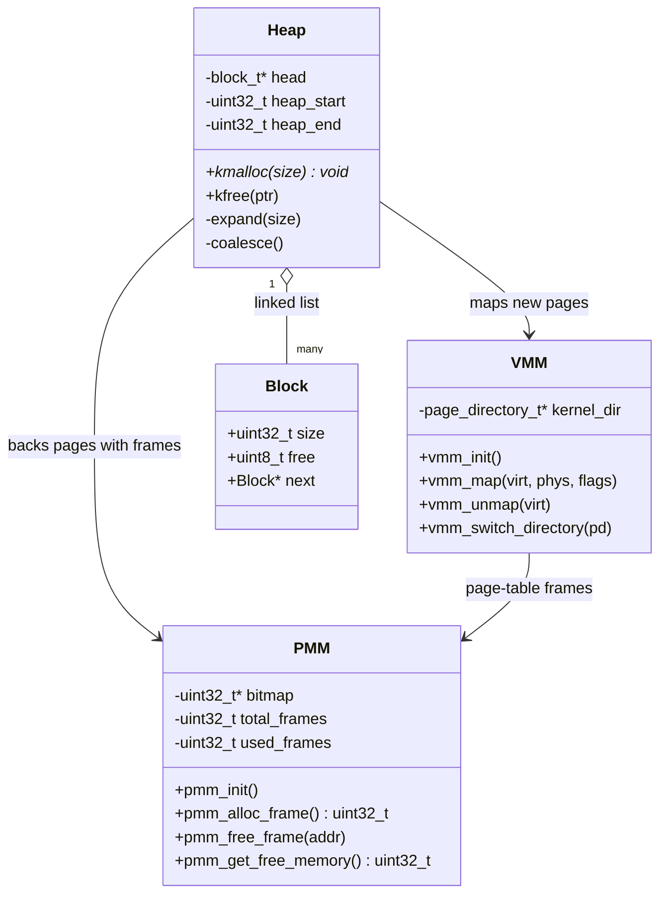
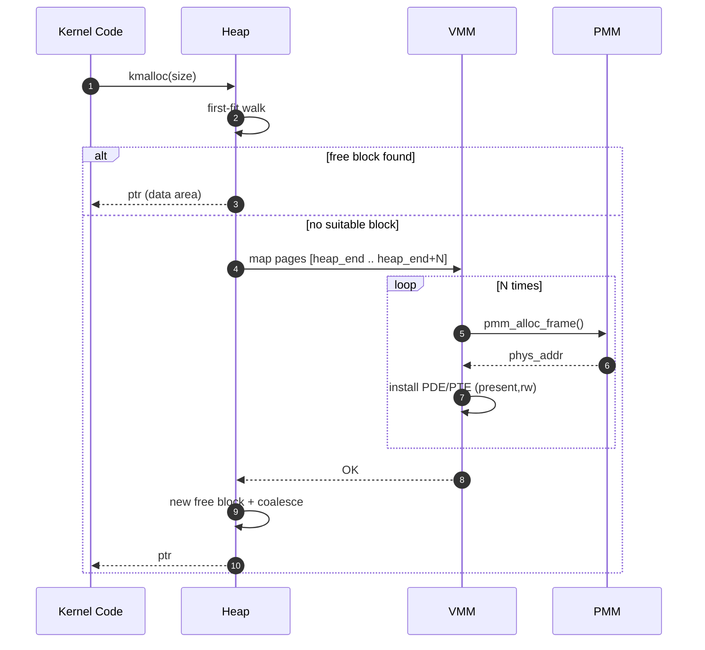
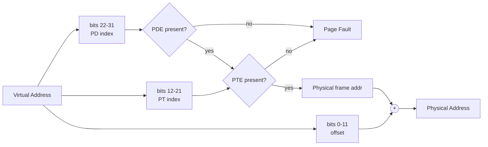

# Subsistema de Gerenciamento de Memória

## Visão Geral

O subsistema de gerenciamento de memória do Munux oferece três camadas distintas de abstração: alocação de frames físicos, paginação de memória virtual e alocação de heap. Essa abordagem em camadas separa responsabilidades ao mesmo tempo em que proporciona uma utilização eficiente da memória.

## Diagrama de Classes UML — Subsistema de Memória

Os três gerenciadores são desacoplados, porém organizados em camadas. O heap consome páginas do VMM, que as mapeia para frames fornecidos pelo PMM.

## Sequência UML — Page Fault e Expansão do Heap

Quando `kmalloc` não consegue atender a uma requisição a partir da free list existente, ele expande o heap solicitando ao VMM que mapeie novas páginas virtuais respaldadas por frames do PMM.

## Atividade UML — Tradução Virtual→Física

## Gerenciador de Memória Física (PMM)

### Filosofia de Design

O PMM opera no nível mais baixo, gerenciando a RAM física como frames discretos de 4KB. Ao trabalhar com blocos de tamanho fixo, o alocador evita os problemas de fragmentação que afligem alocadores de tamanho variável.

### Implementação com Bitmap

Um bitmap rastreia o status de alocação de cada frame do sistema. Cada bit representa um frame de 4KB:
- Bit limpo (0) indica que o frame está disponível para alocação
- Bit setado (1) indica que o frame está atualmente em uso

Essa representação compacta requer apenas um byte a cada 32KB de RAM, tornando-a extremamente eficiente em espaço mesmo para configurações de memória grandes.

O bitmap em si reside no endereço físico 0x100000 (marca de 1MB), posicionado acima do kernel, porém abaixo da memória de uso geral. Essa localização evita conflitos com regiões legadas da BIOS ao mesmo tempo em que mantém o bitmap facilmente acessível.

### Algoritmo de Alocação

A alocação de frames ocorre por meio de uma varredura linear do bitmap:

1. Iterar por cada palavra de 32 bits do bitmap
2. Quando uma palavra não é 0xFFFFFFFF (todos os frames em uso), examinar os bits individuais
3. Encontrar o primeiro bit limpo dentro da palavra
4. Marcar o bit como setado e retornar o endereço físico correspondente
5. Incrementar o contador de frames em uso

Essa abordagem tem complexidade O(n) no pior caso, onde n é o número de frames, mas se comporta bem na prática porque a maioria das alocações encontra frames livres rapidamente.

### Desalocação

Liberar um frame é O(1):

1. Calcular o número do frame dividindo o endereço por 4096
2. Calcular o índice da palavra e o offset do bit
3. Limpar o bit correspondente
4. Decrementar o contador de frames em uso

### Inicialização

Durante a inicialização do sistema, o PMM:

1. Calcula o total de frames com base na RAM disponível
2. Zera o bitmap inteiro
3. Marca os primeiros 2MB como em uso (kernel e bitmap)
4. Registra as contagens de frames totais e disponíveis

A suposição de 32MB de RAM total pode ser substituída por detecção de memória via BIOS em versões futuras.

### Contabilização de Memória

O PMM mantém contadores de frames totais e em uso, permitindo que o sistema consulte a memória disponível a qualquer momento. Essa informação é útil para:
- Exibir o uso de memória aos usuários
- Tomar decisões de alocação
- Detectar condições de pouca memória

## Gerenciador de Memória Virtual (VMM)

### Fundamentos de Paginação

O VMM implementa paginação por hardware para prover proteção de memória e espaços de endereçamento virtual. Cada processo pode acessar o espaço de endereçamento virtual completo de 4GB, mesmo que a RAM física seja muito menor.

### Page Tables de Dois Níveis

A arquitetura x86 usa uma estrutura de paginação de dois níveis:

**Page Directory**: Contém 1024 entradas, cada uma descrevendo uma page table ou marcando uma região como não presente. O registrador CR3 aponta para o page directory atual.

**Page Tables**: Cada entrada do page directory aponta para uma page table contendo 1024 entradas. Cada entrada mapeia uma página virtual de 4KB para um frame físico.

Essa estrutura de dois níveis permite que espaços de endereçamento virtual esparsos sejam representados de forma eficiente - se uma page table não é necessária (todas as páginas não presentes), ela não precisa existir na memória.

### Tradução de Endereços

A tradução de virtual para físico funciona da seguinte forma:

1. Extrair os bits 22-31 do endereço virtual (índice do page directory)
2. Usar isso para indexar o page directory
3. Se o bit present estiver limpo, o endereço não está mapeado
4. Extrair os bits 12-21 do endereço virtual (índice da page table)
5. Usar isso para indexar a page table
6. Se o bit present estiver limpo, o endereço não está mapeado
7. Extrair o endereço do frame físico da entrada da page table
8. Somar os bits 0-11 do endereço virtual (offset da página) para obter o endereço físico final

O hardware executa essa tradução automaticamente a cada acesso à memória quando a paginação está habilitada.

### Mapeamento de Páginas

Para mapear uma página virtual para um frame físico:

1. Calcular os índices de page directory e page table a partir do endereço virtual
2. Verificar se existe uma page table para essa entrada do directory
3. Se não, alocar um frame e criar uma nova page table
4. Ajustar a entrada do page directory para apontar para a page table
5. Ajustar a entrada da page table para apontar para o frame físico
6. Definir as flags apropriadas (present, writable, user-accessible, etc.)

### Desmapeamento de Páginas

Desmapear uma página:

1. Calcular os índices de page directory e page table
2. Limpar a entrada da page table
3. Invalidar a Translation Lookaside Buffer (TLB) para esse endereço

A TLB armazena em cache as traduções de endereço recentes. Quando um mapeamento muda, a entrada correspondente da TLB precisa ser invalidada, ou traduções obsoletas podem ser usadas.

### Identity Mapping

O kernel é mapeado por identidade (identity-mapped), o que significa que seus endereços virtuais são iguais aos endereços físicos. Isso simplifica a programação do kernel, já que a memória física pode ser acessada diretamente sem cálculos de endereço complexos.

Os primeiros 8MB de memória virtual são mapeados por identidade para a memória física, cobrindo o código e os dados do kernel. Esse mapeamento existe em todos os page directories, de modo que o código do kernel permanece acessível independentemente de qual processo esteja ativo.

### Inicialização

Inicialização do VMM:

1. Aloca um page directory para o kernel
2. Cria mapeamentos de identidade para os primeiros 8MB
3. Mapeia o buffer de texto VGA em 0xB8000
4. Habilita a paginação setando o registrador CR0
5. Registra o page directory do kernel para uso futuro

### Troca de Directory

Ao alternar entre processos, o VMM carrega o page directory do novo processo no CR3. Essa única escrita de registrador altera instantaneamente todo o espaço de endereçamento virtual, proporcionando forte isolamento entre processos.

## Alocador de Heap

### Objetivos de Design

O alocador de heap fornece alocação dinâmica de memória no estilo malloc/free para o código do kernel. Os principais requisitos incluem:

- Alocações de tamanho variável
- Utilização eficiente de espaço
- Desempenho razoável
- Implementação simples

### Estrutura de Bloco

O heap é organizado como uma linked list de blocos. Cada bloco possui um cabeçalho contendo:

- Tamanho da área de dados (sem incluir o cabeçalho)
- Flag de free (1 se disponível, 0 se alocado)
- Ponteiro para o próximo bloco

Os dados vêm imediatamente após o cabeçalho. Os usuários recebem um ponteiro para a área de dados, mantendo o cabeçalho oculto.

### Estratégia de Alocação

O alocador usa uma estratégia first-fit:

1. Percorrer a lista de blocos
2. Encontrar o primeiro bloco livre grande o suficiente para a requisição
3. Se o bloco for significativamente maior, dividi-lo em dois blocos
4. Marcar o bloco como alocado
5. Retornar um ponteiro para a área de dados

Se nenhum bloco adequado existir, o heap é expandido mapeando páginas virtuais adicionais respaldadas por frames físicos.

### Divisão (Splitting)

Ao alocar a partir de um bloco livre muito maior do que o necessário:

1. Calcular o espaço necessário (tamanho requisitado + cabeçalho)
2. Se o espaço restante exceder um limiar, criar um novo bloco
3. O novo bloco começa após os dados alocados
4. O cabeçalho do novo bloco é inicializado com o tamanho restante
5. O tamanho do bloco original é reduzido para o tamanho requisitado
6. Encadear o novo bloco na lista

Isso previne a fragmentação interna ao evitar o desperdício de blocos grandes em alocações pequenas.

### Desalocação

Liberar memória marca o bloco como disponível, mas não o devolve imediatamente ao sistema:

1. Encontrar o cabeçalho do bloco (recuar sizeof(header) a partir do ponteiro)
2. Marcar o bloco como free
3. Tentar coalescer com blocos livres adjacentes

### Coalescência (Coalescing)

Após liberar um bloco, o alocador percorre a lista em busca de blocos livres adjacentes:

1. Se o bloco atual está livre e o próximo bloco está livre
2. Combiná-los estendendo o tamanho do bloco atual
3. Pular o cabeçalho do próximo bloco
4. Atualizar o link para apontar além do bloco mesclado

A coalescência previne a fragmentação externa ao reunir blocos divididos em pedaços utilizáveis maiores.

### Expansão do Heap

Quando a alocação não encontra um bloco adequado:

1. Calcular quanto espaço é necessário
2. Arredondar para cima até os limites de página
3. Alocar frames físicos via PMM
4. Mapeá-los na faixa de endereços virtuais do heap via VMM
5. Criar um novo bloco livre abrangendo a nova memória
6. Encadeá-lo na lista de blocos

O heap cresce incrementalmente a partir de um tamanho inicial (1MB) até um limite máximo (256MB).

### Características de Desempenho

A alocação first-fit é O(n) no número de blocos, mas se comporta bem quando a maioria das alocações é atendida rapidamente. A desalocação também é O(n) por causa da coalescência.

Algoritmos mais sofisticados, como segregated free lists ou buddy allocation, poderiam melhorar o desempenho, mas adicionam complexidade. A implementação atual equilibra simplicidade e eficiência para uso no kernel.

## Integração

Essas três camadas trabalham juntas de forma harmoniosa:

1. O VMM usa o PMM para alocar frames para page tables
2. O heap usa o VMM para mapear novas faixas de memória virtual
3. O heap usa o PMM para obter o respaldo físico das páginas virtuais

Essa separação de responsabilidades mantém cada componente focado em uma única responsabilidade, ao mesmo tempo em que proporciona uma poderosa funcionalidade combinada.

## Segurança de Memória

Diversos mecanismos protegem contra erros de memória:

- A paginação impõe permissões de acesso (writable vs read-only)
- Desreferências de ponteiro NULL disparam page faults
- Os cabeçalhos do heap incluem verificações de sanidade
- A detecção de double-free previne corrupção
- Todas as alocações são validadas antes do uso

Embora não sejam infalíveis, essas verificações capturam a maioria dos erros comuns de programação e impedem que a corrupção se propague pelo sistema.

## Suporte a Depuração

O subsistema de memória inclui instrumentação para depuração:

- Contadores rastreiam o total de alocações e liberações
- O uso de memória pode ser consultado a qualquer momento
- Os page faults reportam o endereço que causou a falha
- O logging via porta serial captura falhas de alocação

Essas informações de diagnóstico são inestimáveis ao rastrear vazamentos de memória ou bugs de corrupção.

---

**Arquivos de Implementação**:
- `kernel/memory/pmm.c` - Gerenciador de memória física
- `kernel/memory/vmm.c` - Gerenciador de memória virtual  
- `kernel/memory/heap.c` - Alocador de heap
- `kernel/memory/utils.c` - Utilitários de manipulação de memória
- `kernel/memory/memory.h` - Definições da API pública
