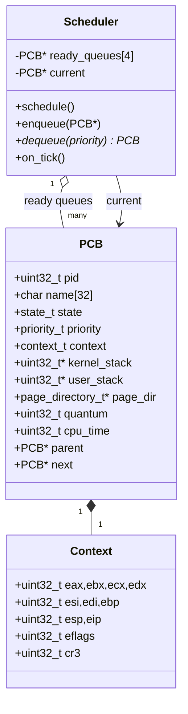
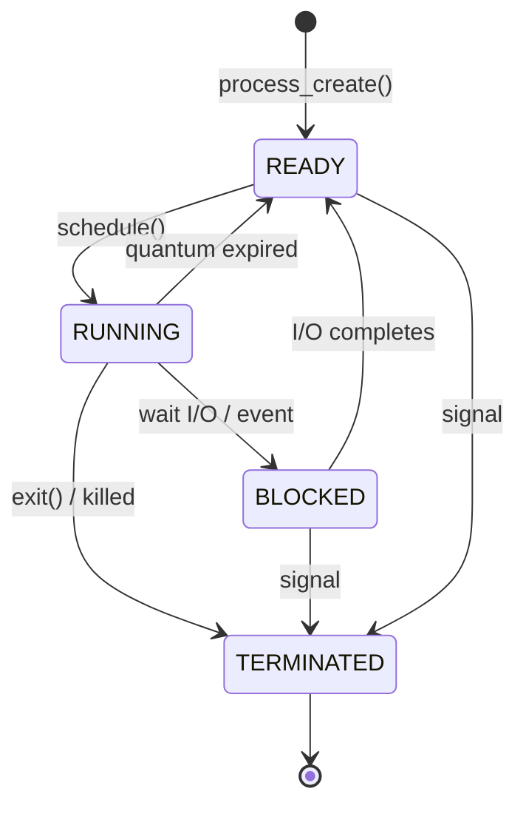

# Gerenciamento de Processos e Escalonamento

## Visão Geral

O Munux implementa multitarefa preemptiva completa, permitindo que múltiplos processos compartilhem a CPU por meio de troca rápida de contexto. Isso cria a ilusão de paralelismo mesmo em sistemas single-core.

## Diagrama de Classes UML — PCB e Scheduler



## Diagrama de Estados UML — Ciclo de Vida do Processo



## Sequência UML — Troca de Contexto Disparada por Timer

```mermaid
sequenceDiagram
    autonumber
    participant PIT
    participant ISR as IRQ0 stub
    participant Disp as irq_handler
    participant TMR as timer_callback
    participant S as scheduler
    participant SW as switch_to (asm)

    PIT->>ISR: IRQ0 raise
    ISR->>Disp: save regs, call dispatcher
    Disp->>TMR: timer_callback(regs)
    TMR->>TMR: ticks++; current->quantum--
    alt quantum > 0
        TMR-->>Disp: return
    else quantum == 0
        TMR->>S: schedule()
        S->>S: enqueue(current)
        S->>S: pick highest non-empty prio queue
        S->>SW: switch_to(old_ctx, new_ctx)
        SW-->>S: ret as new process
    end
    Disp->>ISR: EOI to PIC, iret
```

## Process Control Block (PCB)

### Estrutura

Cada processo é representado por um Process Control Block que contém todas as informações necessárias para gerenciá-lo:

**Identificação**: Um ID de processo único (PID) distingue cada processo. Os PIDs são atribuídos sequencialmente a partir de 1. O nome do processo fornece um identificador legível para humanos.

**Estado**: O estado atual determina o que o processo pode fazer:
- READY: Apto a executar, aguardando em uma fila
- RUNNING: Executando no momento na CPU
- BLOCKED: Aguardando por I/O ou evento
- TERMINATED: Execução finalizada

**Contexto**: O contexto da CPU captura o estado completo do processador no ponto em que o processo foi suspenso:
- Registradores de propósito geral (EAX, EBX, ECX, EDX, ESI, EDI, EBP)
- Ponteiro de pilha (ESP)
- Ponteiro de instrução (EIP)
- Registrador de flags (EFLAGS)
- Ponteiro do diretório de páginas (CR3)

**Memória**: Cada processo tem seu próprio espaço de memória:
- Kernel stack (8KB) para execução em modo kernel
- User stack (8KB) para execução em modo usuário
- Diretório de páginas apontando para o espaço de endereçamento virtual do processo

**Escalonamento**: Informações usadas pelo scheduler:
- Nível de prioridade (LOW, NORMAL, HIGH, REALTIME)
- Quantum restante (fatia de tempo)
- Tempo total de CPU consumido
- Ponteiro para o processo pai

**Encadeamento**: O ponteiro next forma uma lista encadeada de todos os processos do sistema.

### Criação de Processos

Criando um novo processo:

1. Alocar memória para a estrutura do PCB
2. Atribuir um PID único
3. Copiar o nome do processo
4. Alocar as kernel e user stacks
5. Criar ou clonar um diretório de páginas
6. Inicializar o contexto da CPU com o ponto de entrada
7. Definir o estado inicial como READY
8. Adicionar à lista global de processos

O contexto da CPU é inicializado de modo que, quando o processo executar pela primeira vez, ele comece a executar na função de ponto de entrada especificada com uma pilha válida.

### Término de Processos

Encerrando um processo:

1. Marcar o estado como TERMINATED
2. Remover das ready queues
3. Liberar as stacks alocadas
4. Liberar o diretório de páginas e as páginas mapeadas
5. Liberar a estrutura do PCB
6. Se este era o processo atual, invocar o scheduler

Os recursos devem ser liberados com cuidado, na ordem correta, para evitar vazamentos ou ponteiros pendentes.

## Algoritmo de Escalonamento

### Round-Robin com Prioridades

O scheduler implementa escalonamento round-robin com quatro níveis de prioridade. Processos de prioridade mais alta executam antes dos de prioridade mais baixa, mas todos os processos de mesma prioridade compartilham a CPU igualmente.

### Filas de Prioridade

Quatro filas separadas armazenam os processos prontos, uma por nível de prioridade:
- Fila 0: prioridade LOW
- Fila 1: prioridade NORMAL  
- Fila 2: prioridade HIGH
- Fila 3: prioridade REALTIME

Cada fila é circular, com a cauda apontando de volta para a cabeça. Isso simplifica a rotação ao percorrer os processos.

### Quantum

Cada processo recebe um quantum ao ser escalonado, representando o tempo máximo que ele pode executar antes de ser preemptado. O quantum padrão é de 10 ticks de timer (100ms a uma frequência de timer de 100Hz).

A cada tick de timer:
1. Decrementar o quantum do processo atual
2. Se o quantum chegar a zero, invocar o scheduler
3. Caso contrário, continuar executando o processo atual

Essa abordagem preemptiva garante que nenhum processo possa monopolizar a CPU indefinidamente.

### Decisão de Escalonamento

Quando o scheduler executa:

1. Salvar o processo atual de volta em sua ready queue (se ainda for executável)
2. Verificar as filas de prioridade da mais alta para a mais baixa
3. Selecionar o próximo processo da primeira fila não vazia
4. Removê-lo da fila
5. Definir seu estado como RUNNING
6. Restaurar seu quantum para o valor padrão
7. Realizar uma troca de contexto

Se todas as filas estiverem vazias, o processo idle executa, simplesmente parando a CPU até que ocorra uma interrupção.

### Justiça

Dentro de cada nível de prioridade, os processos executam em ordem round-robin estrita. Cada processo executa por seu quantum completo antes que o próximo processo tenha sua vez.

Entre níveis de prioridade, as prioridades mais altas dominam. Um processo REALTIME sempre executará antes de processos NORMAL, independentemente de quanto tempo esses processos estejam esperando.

Esse modelo de prioridade se adequa a sistemas com algumas poucas tarefas importantes (como drivers de dispositivo) que precisam de tempos de resposta rápidos, enquanto o processamento em massa acontece em prioridades mais baixas.

## Troca de Contexto

### Salvar/Restaurar

A troca de contexto é o mecanismo central que habilita a multitarefa. Ela consiste em:

1. Salvar o estado da CPU do processo atual em seu PCB
2. Carregar o estado da CPU do próximo processo a partir de seu PCB

### Implementação em Assembly

A troca de contexto deve ser implementada em linguagem assembly para ter controle preciso sobre o estado da CPU:

```
switch_to_process(old_context, new_context):
    # Save old process state
    Save all general-purpose registers to old_context
    Save ESP, EIP, EFLAGS to old_context
    Save CR3 to old_context
    
    # Restore new process state
    Load all general-purpose registers from new_context
    Load ESP, EIP, EFLAGS from new_context
    Load CR3 from new_context (if different)
    
    # Return causes jump to new process's EIP
    ret
```

A etapa de salvar captura tudo o que é necessário para retomar o processo antigo mais tarde. A etapa de restaurar configura a CPU para que o novo processo continue exatamente de onde parou.

### Troca de Diretório de Páginas

Quando os processos têm diretórios de páginas diferentes, o CR3 deve ser atualizado. Essa única escrita em registrador altera todo o espaço de memória virtual.

Para otimizar, o trocador de contexto compara os valores de CR3 e pula a escrita se ambos os processos usarem o mesmo diretório de páginas (atualmente, todos os processos compartilham o diretório do kernel, mas isso mudará quando o modo usuário for implementado).

### Troca de Pilha

Cada processo tem sua própria kernel stack, permitindo que múltiplos processos estejam simultaneamente "dentro do kernel" (por exemplo, bloqueados em I/O). A troca de contexto atualiza o ESP para apontar para a pilha do novo processo.

### Temporização

As trocas de contexto devem ser rápidas para minimizar o overhead. A implementação atual leva aproximadamente:
- 50-100 ciclos de CPU para salvar os registradores
- 50-100 ciclos para restaurar os registradores  
- 1000+ ciclos se for necessário um flush da TLB

A uma frequência de escalonamento de 100Hz, o overhead da troca de contexto fica bem abaixo de 1% do tempo total de CPU.

## Processo Idle

### Propósito

O processo idle executa quando nenhum outro processo está pronto. Sua única função é parar a CPU até que a próxima interrupção chegue.

```c
void idle_task(void) {
    while (1) {
        __asm__ volatile("hlt");
    }
}
```

A instrução HLT interrompe a execução até que ocorra uma interrupção. Isso economiza energia em comparação com o busy-waiting.

### Escalonamento

O processo idle executa em prioridade LOW e tem PID 0. Ele é criado durante a inicialização do sistema e nunca termina.

Se o scheduler encontrar todas as filas vazias, ele seleciona o processo idle por padrão.

## Sincronização

### Seções Críticas

Alguns trechos de código do kernel não podem ser interrompidos para manter a consistência. As seções críticas desabilitam as interrupções:

```c
cli();  // Clear interrupt flag
// ... critical code ...
sti();  // Set interrupt flag
```

Esse é um mecanismo de sincronização pesado, usado com parcimônia.

### Melhorias Futuras

Primitivas de sincronização apropriadas estão planejadas:
- Mutexes para exclusão mútua
- Semáforos para contagem de recursos
- Variáveis de condição para notificação de eventos
- Read-write locks para estruturas de dados compartilhadas

Elas permitirão acesso concorrente seguro a recursos compartilhados sem desabilitar todas as interrupções.

## Comunicação Entre Processos

### Estado Atual

A implementação atual não possui mecanismos de IPC. Os processos não podem se comunicar diretamente nem compartilhar dados.

### Recursos Planejados

Mecanismos futuros de IPC incluirão:

**Sinais**: Notificações assíncronas como os sinais do UNIX

**Pipes**: Fluxos de bytes unidirecionais entre processos

**Filas de Mensagens**: Passagem estruturada de mensagens

**Memória Compartilhada**: Regiões de memória explícitas mapeadas em múltiplos espaços de endereçamento

**Sockets**: Comunicação no estilo de rede para processos locais ou remotos

## Estados e Transições de Processos

As transições de estado ocorrem da seguinte forma:

**READY → RUNNING**: O scheduler seleciona o processo para executar

**RUNNING → READY**: O quantum expira, o processo é preemptado

**RUNNING → BLOCKED**: O processo aguarda por I/O

**BLOCKED → READY**: O I/O é concluído, o processo pode continuar

**RUNNING → TERMINATED**: O processo termina normalmente

**Qualquer estado → TERMINATED**: O processo é encerrado por erro ou sinal

O scheduler gerencia essas transições, garantindo que os processos se movam corretamente entre os estados.

## Melhorias Futuras

Vários recursos avançados estão planejados:

**Modo Usuário**: Atualmente todos os processos executam em modo kernel. Implementar o modo usuário com separação de ring melhorará a segurança e a estabilidade.

**Copy-on-Write**: Ao fazer fork de processos, as páginas podem ser compartilhadas com semântica copy-on-write para economizar memória.

**Demand Paging**: As páginas podem ser carregadas do disco sob demanda em vez de pré-carregar imagens inteiras de processos.

**Grupos de Processos**: Processos relacionados podem ser gerenciados como uma unidade.

**Nice Values**: Ajuste fino de prioridade para calibrar a justiça.

**Afinidade de CPU**: Em sistemas multi-core, vincular processos a núcleos específicos.

---

**Arquivos de Implementação**:
- `kernel/process/process.c` - Gerenciamento de processos
- `kernel/process/scheduler.c` - Algoritmo de escalonamento
- `kernel/process/switch.asm` - Troca de contexto
- `kernel/process/process.h` - Definições da API pública
