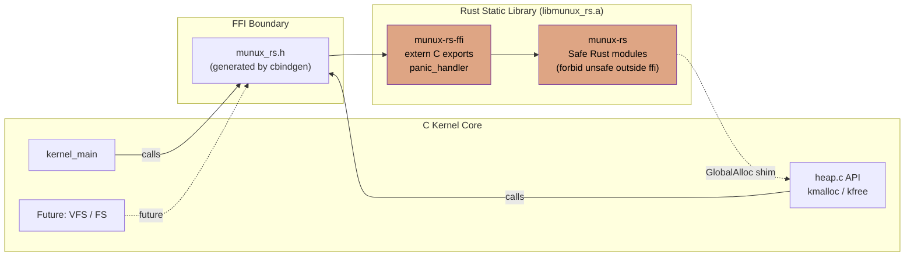

# Integração com Rust

> **Status**: v0.3 — *Adoção do Rust* — lançada.
> O subsistema Rust está integrado ao build do kernel e entrega o primeiro subsistema portado (o alocador de heap). O kernel em C não é afetado pela sua presença, exceto na fronteira explícita de FFI.

## Motivação

O Munux começou como um projeto em C e Assembly, e essas duas linguagens continuam sendo as ferramentas certas para o trabalho que fazem hoje — o bootloader, os stubs de interrupção, a troca de contexto e os subsistemas centrais já bem estabelecidos. Introduzir Rust **não** é uma reescrita. É uma expansão deliberada e delimitada da toolchain para ganhar três propriedades difíceis de obter em C:

1. **Segurança de memória em tempo de compilação** — ownership e borrowing eliminam use-after-free, double-free e data races no nível da linguagem.
2. **Tipos mais fortes a custo zero** — `Option`, `Result`, matches exaustivos e wrappers newtype expressam invariantes que o compilador consegue impor.
3. **Uma história moderna de dependências para código de baixo nível** — crates `no_std` pequenas e auditadas (como `bitflags`, `spin`, `linked_list_allocator`) estão disponíveis sem arrastar um runtime junto.

Esses benefícios importam mais onde os bugs de memória são mais danosos — alocadores, parsers (metadados de sistema de arquivos, cabeçalhos ELF, pacotes de rede) e estruturas de dados compartilhadas entre contextos de interrupção. Esses subsistemas são os primeiros lares naturais do Rust no Munux.

## Não-Objetivos

Para manter este trabalho honesto e focado, os itens a seguir estão explicitamente **fora de escopo** para a adoção do Rust:

- **Substituir o bootloader ou os stubs de interrupção.** Assembly continua sendo a única ferramenta sã para essas camadas.
- **Reescrita indiscriminada de código C que funciona.** Um subsistema só é portado quando há uma justificativa concreta (segurança de memória, retrabalho maior planejado ou melhoria na superfície de testes).
- **Introduzir a biblioteca padrão do Rust.** O kernel é `no_std`. Somente `core` e `alloc` estão disponíveis.
- **Adotar `async` ou qualquer runtime.** O Munux tem seu próprio modelo de escalonamento cooperativo e preemptivo.
- **Trazer crates de terceiros não auditadas.** Cada dependência é revisada e fixada por versão exata.

## Arquitetura de Alto Nível



O workspace Rust produz uma única biblioteca estática, `libmunux_rs.a`. O kernel em C inclui o cabeçalho gerado `munux_rs.h` e chama funções Rust exatamente como chamaria qualquer outra função C — não há convenção de chamada especial, nenhum thunk, nenhum shim emitido pelo linker.

Os dois crates dentro do workspace cumprem papéis distintos:

- **`munux-rs-ffi`** é a fronteira de confiança. Todo bloco `unsafe`, toda exportação `extern "C"` e o panic handler vivem aqui. Esse crate é pequeno e fácil de auditar.
- **`munux-rs`** é a porção em Rust seguro onde a lógica de fato é implementada. Ele proíbe operações unsafe fora de exceções estritamente justificadas, cada uma carregando uma justificativa `// SAFETY:`.

## Toolchain

| Ferramenta | Propósito | Fixada por |
|---|---|---|
| `rustup` | Gerenciador de toolchain | O usuário instala uma vez |
| `rustc` (nightly) | Compilador — necessário para `-Z build-std` e targets customizados | `rust-toolchain.toml` |
| `cargo` | Orquestração do build | Vem junto com o `rustc` |
| Componente `rust-src` | Fonte de `core` / `alloc` para recompilar para o target | `rust-toolchain.toml` |
| `clippy` | Linter (warnings → erros no CI) | `rust-toolchain.toml` |
| `rustfmt` | Formatador (imposto no CI) | `rust-toolchain.toml` |
| `cbindgen` | Gera cabeçalhos C a partir da API pública do Rust | `Cargo.toml` (receita de `cargo install`) |

O canal nightly é necessário apenas porque o kernel precisa recompilar `core` e `alloc` com `-Z build-std`. Existe uma RFC aberta para estabilizar isso; se ela for aceita, o Munux migrará para o Rust estável no mesmo dia em que o recurso estiver disponível.

## Target Customizado

O target do kernel é `i686-unknown-none`, definido por uma especificação JSON em `kernel/rust/i686-unknown-none.json`:

```json
{
  "llvm-target": "i686-unknown-none",
  "data-layout": "e-m:e-p:32:32-p270:32:32-p271:32:32-p272:64:64-f64:32:64-f80:32-n8:16:32-S128",
  "arch": "x86",
  "target-endian": "little",
  "target-pointer-width": "32",
  "target-c-int-width": "32",
  "os": "none",
  "executables": true,
  "linker-flavor": "ld.lld",
  "linker": "rust-lld",
  "panic-strategy": "abort",
  "disable-redzone": true,
  "features": "-mmx,-sse,+soft-float",
  "relocation-model": "static",
  "code-model": "kernel"
}
```

Escolhas-chave:

- **`panic-strategy: abort`** — O unwinding exige maquinário de runtime que o kernel não possui. Um panic deve encerrar imediatamente o caminho ofensor, roteado através da infraestrutura de panic já existente no kernel.
- **`-mmx,-sse,+soft-float`** — O kernel não salva o estado da FPU/SIMD nas trocas de contexto. O Rust não pode emitir instruções que toquem nesses arquivos de registradores.
- **`relocation-model: static`** — Corresponde ao `-fno-pic -fno-pie` do lado C. O kernel roda em um endereço virtual fixo.
- **`disable-redzone: true`** — Uma red zone é insegura em qualquer contexto em que interrupções possam preemptar e corromper a memória de stack abaixo de `%esp`.

## Integração de Build

O `Makefile` de nível superior orquestra o build multilinguagem. A fase Rust é uma única receita:

```makefile
RUST_DIR        = $(KERNEL_DIR)/rust
RUST_TARGET     = i686-unknown-none
RUST_PROFILE    = release
RUST_TARGET_DIR = $(RUST_DIR)/target/$(RUST_TARGET)/$(RUST_PROFILE)
RUST_LIB        = $(RUST_TARGET_DIR)/libmunux_rs.a

$(RUST_LIB): $(shell find $(RUST_DIR) -name '*.rs' -o -name 'Cargo.toml')
	@echo "🦀 Building Rust static library..."
	cd $(RUST_DIR) && cargo build --release \
	    --target $(RUST_TARGET).json \
	    -Z build-std=core,alloc

# The final link consumes libmunux_rs.a as one more input.
$(KERNEL_ELF): $(KERNEL_OBJS) $(RUST_LIB)
	$(LD) $(LDFLAGS) -o $@ \
	    $(BUILD_DIR)/multiboot.o \
	    $(filter-out $(BUILD_DIR)/multiboot.o,$(KERNEL_OBJS)) \
	    $(RUST_LIB)
```

Targets de conveniência:

| Target | Efeito |
|---|---|
| `make rust` | Compila apenas `libmunux_rs.a` |
| `make rust-check` | `cargo check` + `cargo clippy -- -D warnings` |
| `make rust-test` | Roda os testes unitários no host (apenas módulos de lógica pura) |
| `make rust-fmt` | `cargo fmt --check` (gate do CI) |
| `make rust-clean` | `cargo clean` no workspace Rust |

A fase Rust paraleliza com as fases de C/Assembly sob `make -j`, já que as saídas são independentes até a invocação final do `ld`.

## Convenções de FFI

Toda função que cruza a fronteira segue um contrato pequeno e previsível.

**No lado Rust (`munux-rs-ffi/src/lib.rs`):**

```rust
/// Allocates `size` bytes from the kernel heap with `align` alignment.
///
/// Returns a null pointer on failure.
///
/// # Safety
/// The caller must eventually free the returned pointer with
/// `munux_rs_free`, passing the same size and alignment used here.
#[no_mangle]
pub unsafe extern "C" fn munux_rs_alloc(size: usize, align: usize) -> *mut u8 {
    // SAFETY: We forward to the audited safe-Rust implementation.
    munux_rs::alloc::allocate(size, align)
}
```

**No lado C (`kernel/rust/include/munux_rs.h`, gerado pelo `cbindgen`):**

```c
/* Generated by cbindgen — do not edit by hand. */
uint8_t *munux_rs_alloc(size_t size, size_t align);
void     munux_rs_free(uint8_t *ptr, size_t size, size_t align);
```

Regras impostas na revisão de código:

1. Todo nome de função exportada tem o prefixo `munux_rs_`.
2. Toda função exportada usa tipos primitivos compatíveis com C ou structs `#[repr(C)]` — nada de enums Rust, nada de `&str`, nada de `String`, nada de trait objects.
3. Toda função exportada é `pub unsafe extern "C" fn` e documenta seu contrato de segurança.
4. Os cabeçalhos gerados (`include/`) são commitados no repositório para que um revisor possa fazer diff das mudanças de API sem rodar o `cbindgen`.
5. Qualquer alteração em uma assinatura exportada exige regenerar o cabeçalho no mesmo commit.

## Contrato do Alocador

O Rust precisa de um alocador global para usar `alloc::boxed::Box`, `alloc::vec::Vec` e afins. Em vez de introduzir um segundo heap, o lado Rust **envolve o heap existente do kernel** por meio de um shim de `GlobalAlloc`:

```rust
// In munux-rs-ffi
extern "C" {
    fn kmalloc(size: usize) -> *mut u8;
    fn kfree(ptr: *mut u8);
}

struct KernelHeap;

unsafe impl GlobalAlloc for KernelHeap {
    unsafe fn alloc(&self, layout: Layout) -> *mut u8 {
        // SAFETY: kmalloc is the kernel's audited allocator; alignment
        // requirements above MIN_ALIGN are handled by a small adjustment.
        unsafe { kmalloc(layout.size()) }
    }
    unsafe fn dealloc(&self, ptr: *mut u8, _layout: Layout) {
        unsafe { kfree(ptr) }
    }
}

#[global_allocator]
static ALLOCATOR: KernelHeap = KernelHeap;
```

Esse heap único é essencial durante a transição da v0.3: ele permite que o alocador de heap seja portado para Rust de forma **incremental**. Os pontos de entrada em C `kmalloc` / `kfree` permanecem estáveis, enquanto suas implementações são progressivamente redirecionadas para os internos em Rust seguro.

## Tratamento de Panic

O `#[panic_handler]` do Rust roteia um panic do Rust pelo caminho de panic já existente no kernel, de modo que a experiência é idêntica do ponto de vista do usuário:

```rust
// In munux-rs-ffi/src/panic.rs
use core::panic::PanicInfo;

extern "C" {
    fn serial_writestring(port: u16, s: *const u8);
    fn kernel_panic(msg: *const u8) -> !;
}

#[panic_handler]
fn panic(info: &PanicInfo) -> ! {
    // A small inline formatter writes the message to COM1 first,
    // then hands off to the kernel's panic routine which halts the CPU.
    // SAFETY: serial_writestring and kernel_panic are kernel entry
    // points expecting NUL-terminated C strings.
    unsafe {
        serial_writestring(0x3F8, b"RUST PANIC: \0".as_ptr());
        // ... write info.message() / info.location() ...
        kernel_panic(b"Rust panic\0".as_ptr())
    }
}
```

Combinado com `panic-strategy: abort` na especificação do target, isso garante que nenhuma tabela de unwinding seja emitida e que o tamanho do binário permaneça pequeno.

## Política de Segurança

A raiz do crate Rust impõe:

```rust
#![no_std]
#![forbid(unsafe_op_in_unsafe_fn)]
#![deny(clippy::undocumented_unsafe_blocks)]
#![deny(clippy::missing_safety_doc)]
#![warn(clippy::pedantic)]
```

Consequências práticas:

- Uma função marcada como `unsafe fn` **não** permite automaticamente operações `unsafe` dentro do seu corpo. Cada uma deve estar em um bloco `unsafe { … }` explícito.
- Todo bloco `unsafe` deve carregar um comentário `// SAFETY:` explicando o invariante do qual se depende.
- O crate `munux-rs` contém zero blocos `unsafe` sob revisão normal; exceções exigem uma justificativa escrita na mensagem de commit e aprovação do revisor.
- Todo `unsafe` vive em `munux-rs-ffi`, que é pequeno o suficiente para ser auditado de uma só vez.

## Plano de Portabilidade

Os subsistemas migram para Rust **somente quando há um ganho concreto**. O trabalho da v0.3 mira um subsistema; fases posteriores serão oportunistas.

### v0.3 — Alocador de Heap (Concluído)

O alocador de heap foi o primeiro port escolhido porque:

- Sua superfície de API (`kmalloc`, `kfree`) é pequena e estável.
- Bugs de memória em um alocador se manifestam como corrupção silenciosa em outro lugar — exatamente a classe de falha que o Rust previne.
- Ele pode ser medido em benchmarks de forma determinística, facilitando a detecção de regressões.

Resultado:

- [`heap.rs`](../kernel/rust/munux-rs/src/heap.rs) implementa a free list first-fit com coalescência de blocos adjacentes, o cabeçalho de bloco `#[repr(C)]` corresponde ao `heap_block_t` legado byte a byte, e o alocador é protegido por um `IrqMutex<T>` que combina um spin-lock com `cli` / `sti`.
- [`heap.c`](../kernel/memory/heap.c) agora é um wrapper fino: ele detém o mapeamento inicial de páginas via PMM / VMM, expõe um callback `munux_c_heap_grow` e encaminha `kmalloc` / `kfree` para as exportações de FFI do Rust.
- Os pontos de entrada em C legados são compatíveis byte a byte — nenhum chamador precisou mudar.

### v0.4 — Ports Oportunistas Durante o Trabalho de Serviços de Sistema

Conforme a Fase 2 introduz o VFS e o ext2, os parsers de metadados em disco (superblocks, inodes, entradas de diretório) são excelentes candidatos a Rust:

- Eles consomem dados não confiáveis vindos do disco — uma superfície clássica de bugs de memória.
- Eles são stateless e fáceis de testar.
- Eles não têm restrições de tempo real.

### Longo Prazo — Código Novo por Padrão em Rust

Uma vez que a toolchain esteja assentada, o padrão para novos subsistemas muda: **código novo é escrito em Rust, a menos que haja um motivo específico para usar C ou Assembly**. O código C existente que funciona é deixado em paz, a menos que já esteja passando por um retrabalho substancial de qualquer forma.

## Estratégia de Testes

Duas superfícies de teste:

**Testes unitários no host** — Módulos de lógica pura (estruturas de dados, parsers, manipulação de bits) vivem em módulos que compilam tanto para o target do kernel quanto para o host do desenvolvedor. O target do host habilita `cargo test`, iteração rápida e ferramentas como `miri` para detecção de comportamento indefinido.

**Smoke tests dentro do kernel** — Um diretório `tests/` sob `munux-os/` contém rotinas de teste do lado do kernel que exercitam o subsistema Rust em um boot no QEMU. Elas rodam como parte do `make test` e verificam o contrato de FFI de ponta a ponta.

## Gates de CI

Todo commit precisa passar, nesta ordem:

1. `cargo fmt --check` — A formatação é mecânica e inegociável.
2. `cargo clippy --all-targets -- -D warnings` — Todos os lints do clippy são erros.
3. `cargo build --release --target i686-unknown-none.json -Z build-std=core,alloc` — O target do kernel precisa compilar sem erros.
4. `cargo test` (target do host) — Os testes unitários executáveis no host precisam passar.
5. `make` (build completo do kernel) — O ELF final precisa linkar.
6. Smoke test `make run` no QEMU — O kernel precisa dar boot e o subsistema Rust precisa inicializar sem entrar em panic.

## Lições da Integração da v0.3

Um punhado de detalhes só ficou óbvio quando o build foi de fato exercitado de ponta a ponta. Eles ficam registrados aqui para que o próximo contribuidor não precise reaprendê-los:

- **`-mno-sse -mno-sse2 -mno-mmx -mgeneral-regs-only` são obrigatórias no lado C.** Sem elas, o GCC com `-O2` vetoriza alegremente `memset`/`memcpy` com SSE2 (`movd`, `punpcklbw`, `pshufd`). O kernel nunca habilita SSE em `CR0`/`CR4`, então a primeira operação vetorizada dispara `#UD`/`#NM`, o que cascateia para um triple-fault e reset da CPU. O lado Rust já desabilita esses recursos via a especificação de target customizada; o lado C precisa acompanhar.
- **A sintaxe do JSON de target-spec mudou com o tempo.** Nightlies recentes exigem que `target-pointer-width` e `target-c-int-width` sejam inteiros (não strings), precisam de `i128:128` no data-layout e rejeitam `+soft-float` como recurso explícito (use a lista de desabilitação `-mmx,-sse,...` em vez disso). O `.cargo/config.toml` também precisa de `json-target-spec = true` sob `[unstable]`.
- **`cargo clippy --all-targets` vai tentar compilar o harness de testes do target do kernel, que não tem crate `test` nem panic handler.** Use `cargo clippy --lib` em vez disso.
- **Antes da v0.3 havia um bug latente de bootstrap em `vmm_init`** — ele alocava o page directory através de `kmalloc_aligned`, que dependia do heap, que dependia do VMM. O bug era inofensivo apenas porque `kernel_main` nunca chamava de fato as funções de init. A fiação da v0.3 o expôs; a correção é pegar o PD diretamente de um frame físico.

## Questões em Aberto

Estas ficam registradas honestamente como incógnitas conhecidas, em vez de enterradas:

- **Alinhamento no shim de `GlobalAlloc`.** O `kmalloc` atualmente alinha a `sizeof(void *)`. Alocações que exigem alinhamento maior (linhas de cache, limites de página) precisam de um `kmalloc` mais rico ou de um caminho de aligned-alloc separado. O `kmalloc_aligned` atual sobre-aloca por uma página e arredonda para cima; uma API de aligned-alloc adequada é candidata à v0.4.
- **Migração para o canal estável.** O plano é acompanhar a RFC de estabilização do `build-std` e sair do nightly assim que for viável.
- **Ponto flutuante em modo usuário.** Quando o modo usuário chegar, a FPU vai precisar de save/restore preguiçoso. A política de no-SIMD de todo o kernel ainda se aplica; o tratamento do modo usuário é uma discussão de design separada.
- **Descoberta de memória.** `pmm_init(0x02000000)` atualmente fixa 32 MiB para corresponder ao padrão do QEMU. Ler a estrutura de info do multiboot para obter o `mem_upper` real é uma tarefa da v0.4.

---

**Veja Também**:

- [ARCHITECTURE.md](ARCHITECTURE.md) — Como a camada Rust se encaixa no kernel como um todo
- [BUILD.md](BUILD.md) — Como instalar a toolchain e compilar o sistema
- [ROADMAP.md](ROADMAP.md) — Cronograma da Fase 1.5 e critérios de aceitação
- [STRUCTURE.md](../../docs/STRUCTURE.md) — Layout de diretórios do workspace Rust
