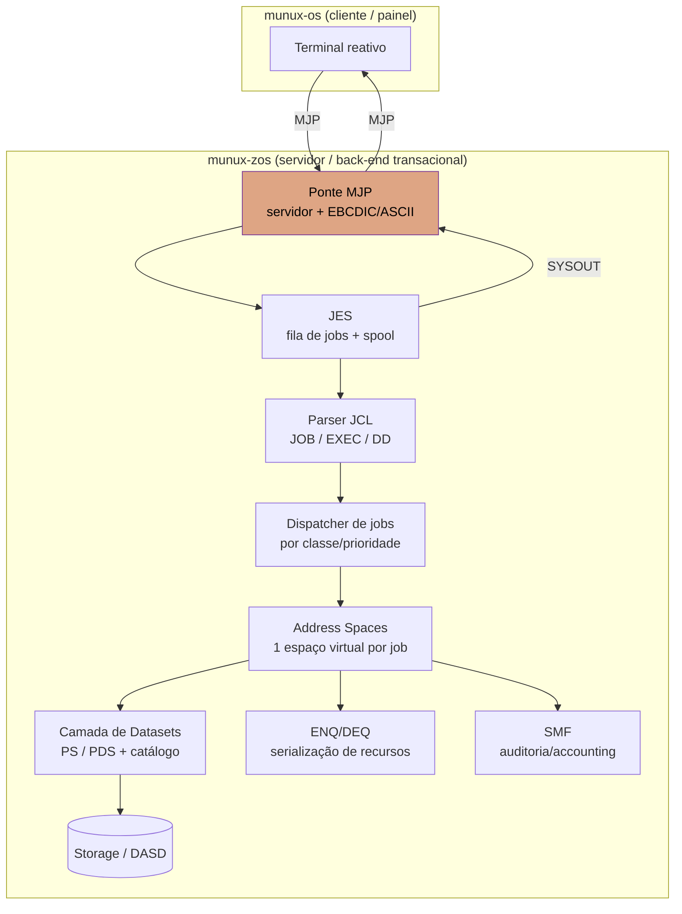

# Arquitetura — Munux z/OS

> **Documento de projeto.** Descreve o alvo arquitetural do flavor mainframe. Nada
> aqui está implementado ainda — é o plano contra o qual o código será escrito.

## Princípio central

O `munux-zos` não é um SO interativo. É um **processador de jobs**: entra trabalho por
uma fila, é executado com isolamento e serialização rigorosos, e sai resultado por
outra fila. A disciplina de mainframe (integridade > latência) guia cada decisão.

## Camadas



## Componentes

### Ponte MJP (borda)
Servidor do [Munux Job Protocol](PROTOCOL.md). É o **único** ponto de entrada externo.
Faz enquadramento binário, tradução **EBCDIC ↔ ASCII** e valida todo input como hostil
(o cliente é _untrusted_). Ver seção de segurança.

### JES — Job Entry Subsystem
Mantém a **INPUT queue**, o **spool** (SYSIN/SYSOUT) e o ciclo de vida do job
(`INPUT → ACTIVE → OUTPUT → PURGE`). Atribui número de job (`JOBnnnnn`).

### Parser JCL
Lê os statements `//JOB`, `//EXEC`, `//DD` e monta o plano de _steps_ do job, com as
alocações de dataset (DD) que cada step enxerga.

### Dispatcher + Address Spaces
Cada job recebe um **address space** próprio (espaço de endereçamento virtual isolado —
o análogo pesado de um processo). O dispatch é orientado a lote (por classe/prioridade
de job), não a time-sharing interativo.

### Camada de Datasets
Storage **orientado a registro** (não byte-stream): **PS** (sequencial) e **PDS**
(particionado, com _members_). Um **catálogo** resolve o **DSN** (dataset name
hierárquico) para a localização física. Assenta sobre o storage da arquitetura escolhida
(Fase 0).

### ENQ/DEQ (serialização)
Serialização global de recursos por nome (exclusivo/compartilhado), garantindo
concorrência **determinística** entre jobs — sem race conditions.

### SMF (auditoria)
Registros de contabilização por job (CPU, I/O, tempo de fila). Base de relatórios.

## Fronteira de confiança

```
[munux-os / rede]  ──untrusted──▶  [Ponte MJP]  ──validado──▶  [núcleo z/OS]
```

- Tudo que entra pela ponte é **hostil até prova em contrário**: valida tamanho de
  frame, versão, comprimentos declarados vs reais, e nunca confia em offsets do cliente.
- A tradução EBCDIC↔ASCII acontece na borda, isolando o núcleo de encoding externo.
- Isolamento por **address space** contém falha/abuso de um job sem derrubar o sistema.

## Arquitetura alvo (Fase 0 — decidida): s390x autêntico

Decidido em 2026-07-01: o munux-zos tem como alvo o **s390x (z/Architecture)** — o
hardware real da linhagem z/OS —, rodando no emulador `qemu-system-s390x`. A estrutura
interna descrita acima (JES/JCL/datasets/ENQ/DEQ/ponte MJP) é **independente de ISA**; o
que muda por esta escolha é a camada baixa: boot, memória, interrupções e I/O.

**Por quê o autêntico:** a proposta é ser o z/OS "de verdade" em escala didática, não um
x86 com roupa de mainframe. **Nada** do munux-os (x86) é reaproveitado — é um segundo
kernel do zero.

### Consequências de toolchain (verificadas)

- **Rust:** não existe target bare-metal pronto para s390x (o `rustc` só traz
  `s390x-unknown-linux-gnu` / `-musl`, ambos hospedados). Será preciso um **target custom
  `s390x-unknown-none.json`** (`no_std`, 64-bit, big-endian) + `-Z build-std` para
  `core`/`alloc`/`compiler_builtins` — o mesmo padrão do `i686-unknown-none` do munux-os.
  O LLVM já gera código s390x, então o caminho é viável.
- **Emulador:** `qemu-system-s390x` ainda não está instalado, mas está no repositório
  (`extra/qemu-system-s390x` + `-firmware`). Instalar na Fase 1:
  `sudo pacman -S qemu-system-s390x qemu-system-s390x-firmware`.
- **Boot:** a máquina padrão é a `s390-ccw-virtio`; o firmware `s390-ccw` carrega o kernel
  (via `-kernel <elf>`) e entrega o controle no ponto de entrada, com uma PSW inicial.

### O que muda em relação ao munux-os (x86)

| Camada | munux-os (x86) | munux-zos (s390x) |
|---|---|---|
| Interrupções | IDT + PIC | **PSW** + PSWs old/new por classe de interrupção em low-core |
| Memória | paginação (2 níveis) | **DAT** (region/segment/page tables) |
| I/O | port I/O (`inb`/`outb`) | **channel subsystem** (CCW) + virtio-ccw |
| Console cedo | VGA / serial | **SCLP** (Service-Call) |
| Endianness | little-endian | **big-endian** |

Esses detalhes de baixo nível (PSW, DAT, SCLP, CCW) exigem consulta cuidadosa ao
_z/Architecture Principles of Operation_ (IBM) e às particularidades do QEMU s390x — o
trabalho de fato começa na Fase 1.
