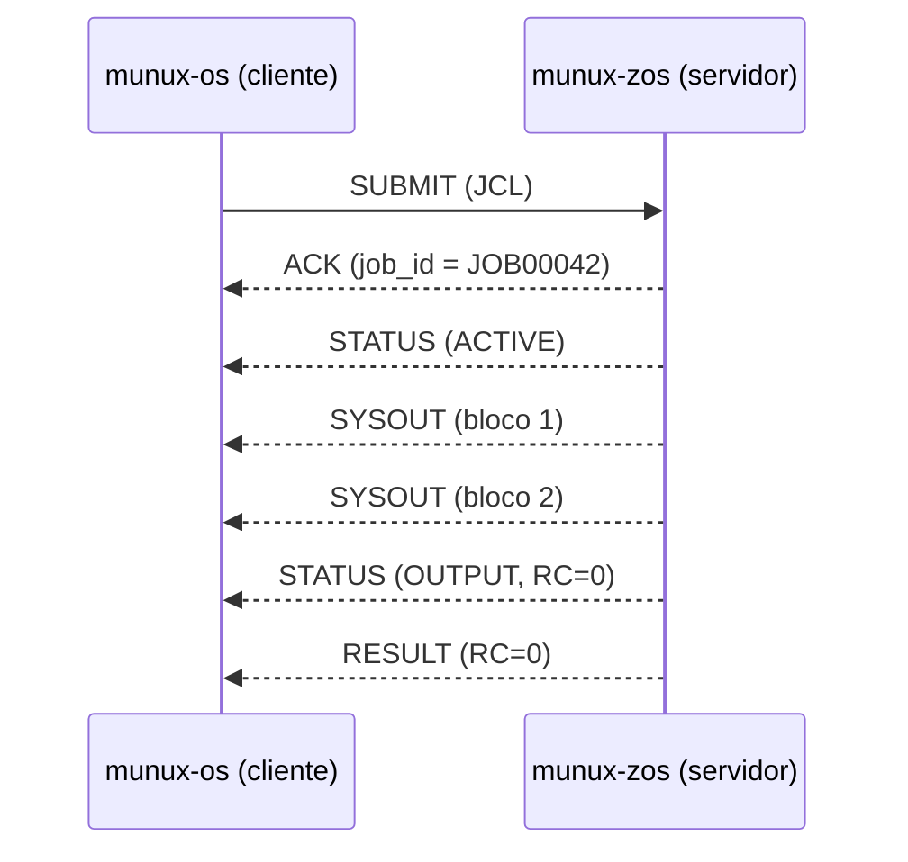

# MJP — Munux Job Protocol (rascunho v0)

> **Documento de projeto.** Especificação da ponte entre `munux-os` (cliente) e
> `munux-zos` (servidor). **Rascunho** — nenhum lado está implementado. Serve para
> alinhar o contrato antes de escrever código dos dois lados.

## Objetivo

Permitir que o `munux-os` — o painel de controle reativo — **submeta jobs** ao
`munux-zos` e **consuma resultados** (status + SYSOUT), por um protocolo binário de
baixo nível, performático e validável. É a reprodução didática da integração
"sistema moderno ↔ core transacional em mainframe".

## Modelo

- **Cliente:** `munux-os`. **Servidor:** `munux-zos` (o servidor MJP é a única porta
  de entrada externa do z/OS).
- **Orientado a mensagens**, sobre um transporte de fluxo confiável (a definir na
  Fase 7: socket/pipe/porta serial, conforme a arquitetura da Fase 0).
- **Assíncrono:** o cliente submete e recebe atualizações de status e blocos de SYSOUT
  conforme o job progride; não há bloqueio síncrono obrigatório.

## Enquadramento (framing)

Todo frame tem um cabeçalho fixo de 12 bytes, **big-endian** (convenção de rede e de
mainframe), seguido de payload:

```
 offset  tam  campo        descrição
 0       1    version      versão do protocolo (0x00 = rascunho)
 1       1    type         tipo de mensagem (tabela abaixo)
 2       2    flags        bitfield reservado (0 no v0)
 4       4    job_id       JOBnnnnn associado (0 antes do ACK)
 8       4    length       tamanho do payload em bytes (validado vs recebido)
 12      …    payload      conteúdo específico do tipo
```

Regra de ouro (Zero Trust): `length` é **declarado pelo cliente** e portanto suspeito.
O servidor impõe um teto de frame, e nunca aloca/copia com base em `length` sem antes
comparar com os bytes efetivamente lidos.

## Tipos de mensagem

| type | nome | direção | payload |
|:---:|---|:---:|---|
| 0x01 | `SUBMIT`   | cliente → z/OS | JCL do job (texto) |
| 0x02 | `ACK`      | z/OS → cliente | `job_id` atribuído (no cabeçalho) |
| 0x03 | `NAK`      | z/OS → cliente | código + motivo da recusa |
| 0x10 | `STATUS`   | z/OS → cliente | estado: `INPUT/ACTIVE/OUTPUT/PURGE` + RC |
| 0x11 | `SYSOUT`   | z/OS → cliente | bloco de saída (stream, pode repetir) |
| 0x12 | `RESULT`   | z/OS → cliente | código de retorno final do job |
| 0x20 | `QUERY`    | cliente → z/OS | consulta estado de `job_id` |
| 0x21 | `CANCEL`   | cliente → z/OS | pedido de cancelamento de `job_id` |
| 0x7F | `ERROR`    | ambos | erro de protocolo (versão/frame inválido) |

## Fluxo típico



## Codificação de texto

O núcleo do `munux-zos` trabalha em **EBCDIC** (autenticidade de mainframe). A **ponte**
traduz EBCDIC ↔ ASCII na borda: JCL e SYSOUT trafegam em ASCII no MJP e são convertidos
ao cruzar a fronteira do z/OS. Isso isola o núcleo do encoding externo e reproduz uma
dor real de integração corporativa.

## Segurança (Zero Trust na borda)

- Validar `version` e `type` **antes** de qualquer parsing de payload.
- Impor teto de tamanho de frame; rejeitar `length` incompatível com o lido.
- `job_id` em `QUERY`/`CANCEL` é autorizado contra a sessão do cliente (evita um cliente
  mexer em job de outro — análogo a IDOR).
- Nenhum offset/ponteiro vem do cliente; o servidor mantém suas próprias tabelas.
- Frame malformado → `ERROR` + encerramento limpo da sessão, sem vazar estado interno.

## Versionamento

`version = 0x00` marca o rascunho. Mudanças incompatíveis incrementam o byte; o servidor
recusa (`ERROR`) versões que não reconhece. Campos `flags` reservados permitem extensão
compatível.

## Status

Rascunho de contrato. Congelar a v0 antes de implementar o servidor (Fase 7 do
[ROADMAP](ROADMAP.md)) e o cliente correspondente no `munux-os`.
